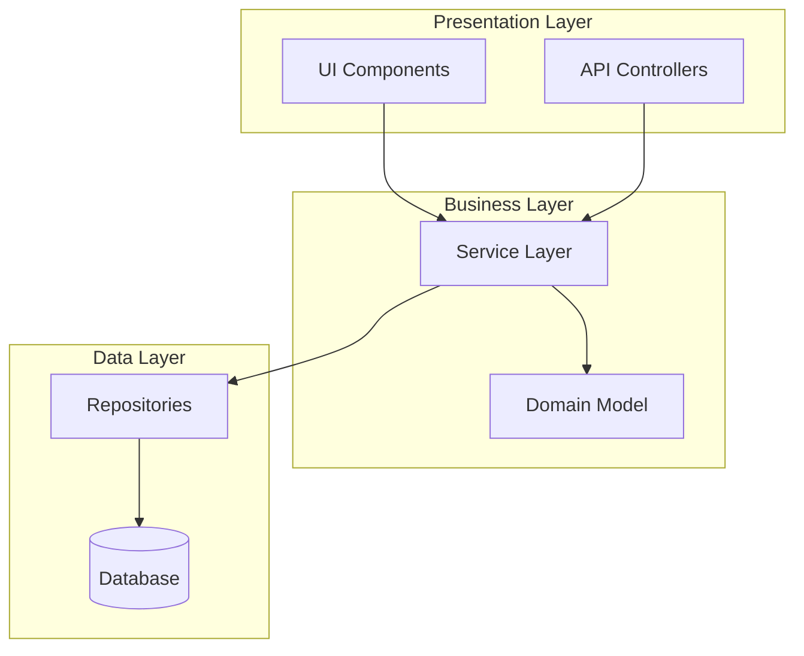
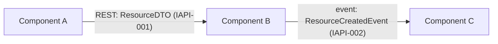
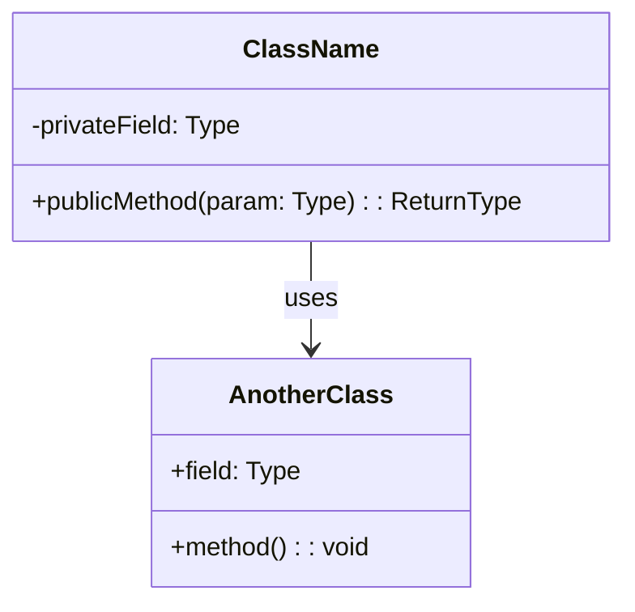
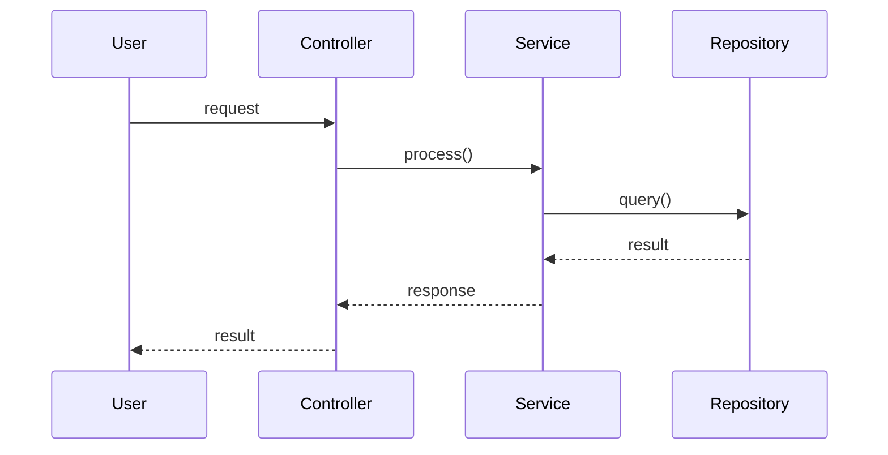
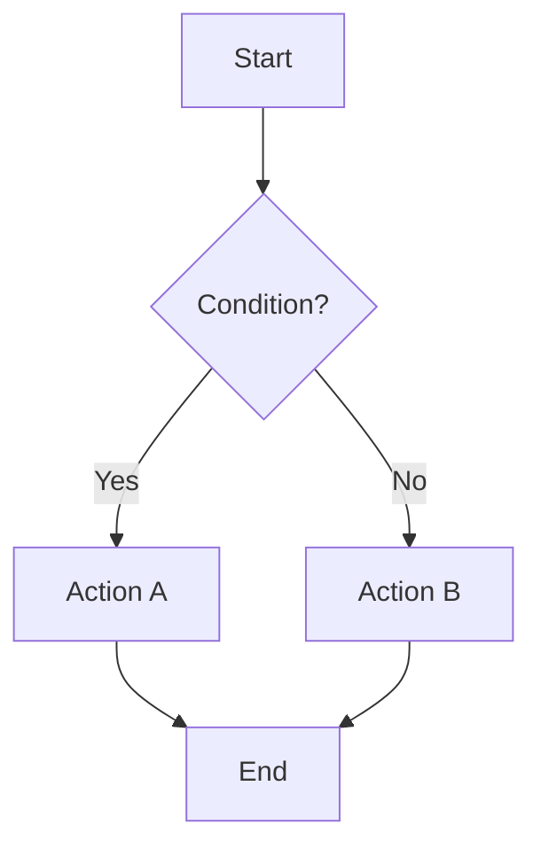
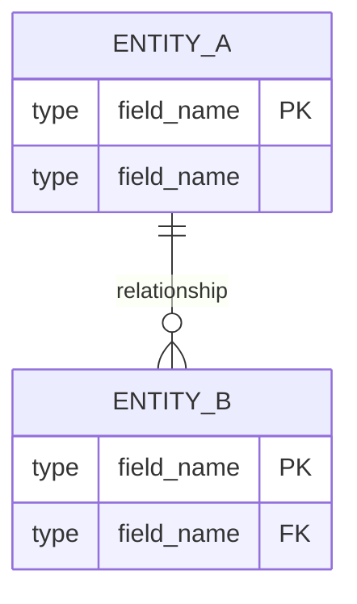
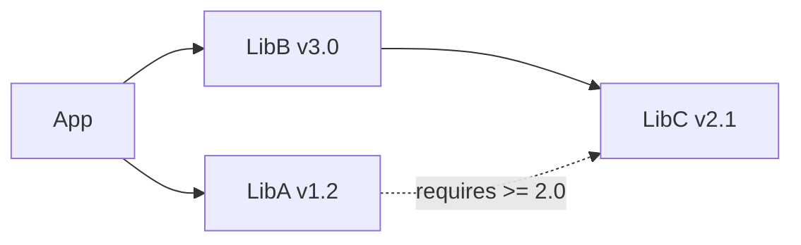
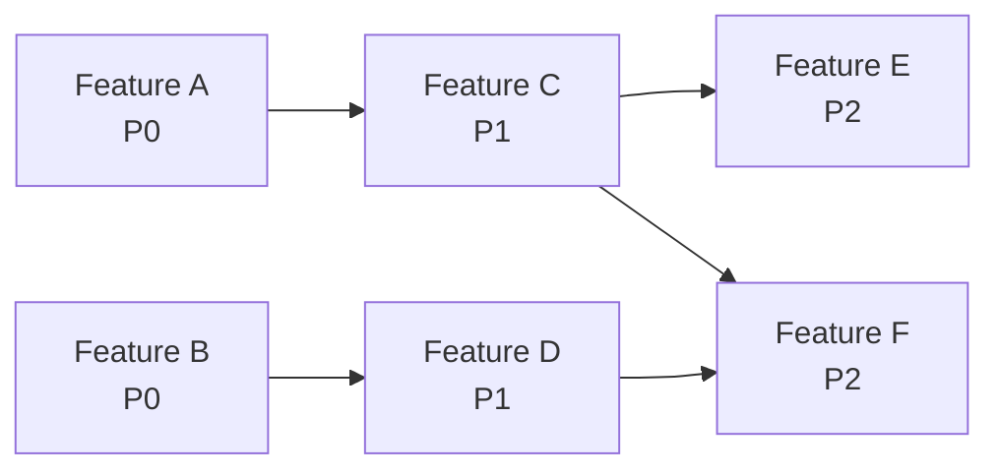

# <Project Name> — 设计文档（Design Document）

**日期（Date）**: YYYY-MM-DD
**状态（Status）**: Approved
**SRS 参考（SRS Reference）**: docs/plans/YYYY-MM-DD-<topic>-srs.md

## 0. 项目结构（Project Structure）

> **对存量项目（brownfield）强制必填**。全新项目（greenfield）请标注 "[Not applicable — greenfield project]"。
>
> 本章节记录既有代码库的顶层布局，以便 Feature Design SubAgent 知道新代码应放在哪里，以及哪些目录禁止改动。内容来自 `docs/explore/codebase-research.md`（若存在）与文件系统直接检查。

### 0.1 顶层布局（Top-level Layout）

```
<project-root>/
├── src/                   # [description: main application code]
├── tests/                 # [unit + integration tests]
├── scripts/               # [build/deploy utilities]
├── docs/                  # [architecture / plans / rules]
├── <other>/               # [...]
```

### 0.2 模块边界（Module Boundaries）

| Module / Directory | Responsibility | Owners / Stability |
|--------------------|---------------|--------------------|
| `src/auth/` | Authentication, session management | Stable — changes require security review |
| `src/payments/` | Billing integration | Frozen — delegate changes to Payments team |
| `src/internal/utils/` | Shared utilities | Growing — safe to extend |

### 0.3 禁止 / 只读路径（Forbidden / Read-only Paths）

- `src/generated/` —— 自动生成代码，严禁直接编辑
- `vendor/` —— 第三方代码，仅通过 overlay 打补丁
- `<legacy-path>/` —— 计划下线；不得在此新增代码

### 0.4 新代码放置规则（New-code Placement Rules）

- 每个 feature：新模块置于 `src/<domain>/`，`<domain>` 与该 feature 的主实体一致（参见 SRS 的领域术语表）
- 测试按镜像路径置于 `tests/<domain>/`（或遵循项目原有约定）
- 共享 helper 仅当被 3 个以上 feature 复用时，才放入 `src/internal/utils/`

## 1. 设计驱动因素（Design Drivers）
[关键的 SRS 输入：塑造本设计的 NFR 阈值、约束、接口需求]

## 2. 方案选型（Approach Selection）
[所选方案及其论证。对所考虑备选方案的简述。]

## 3. 架构（Architecture）

### 3.1 架构概览（Architecture Overview）
[顶层系统描述：关键组件、各自职责以及交互]

### 3.2 逻辑视图（Logical View）
[描述系统如何分解为 package/module/layer。展示主要抽象及其关系。]



[用项目实际的逻辑架构替换上述示例。展示 layer、package、module 以及其依赖方向。]

### 3.3 组件图（Component Diagram）

[展示主要运行时组件及其交互。
 每条边**必须**包含：(1) 协议；(2) 引用 §6.2 Contract ID 的 schema 名称。]



[用实际组件与交互替换上述示例。缺少 Contract ID 标签的边即为设计缺陷 —— 需要补一行 §6.2，或说明其为框架级依赖（无运行期数据交换）。]

### 3.4 技术栈选型（Tech Stack Decisions）
[针对 SRS 约束与 NFR 进行论证]
[说明本架构如何满足 NFR 阈值]

## 4. 关键 Feature 设计（Key Feature Designs）

> **填写说明**：为每一个关键 feature（或 feature 组）创建一个子章节。每个子章节**至少**包含：一张类图 + 一张行为图（sequence 或 flow）。对于复杂 feature，四种视图全部包含。

### 4.N Feature: <Feature Name> (FR-xxx)

#### 4.N.1 概览（Overview）
[1-2 句：该 feature 做什么，满足哪些 SRS 需求]

#### 4.N.2 类图（Class Diagram）
[展示相关 class/module，其属性、方法与关系]



#### 4.N.3 时序图（Sequence Diagram）
[展示主成功场景下对象/组件之间的交互]



#### 4.N.4 流程图（Flow Diagram）
[展示流程/逻辑走向，包含决策点与错误路径]



#### 4.N.5 设计说明（Design Notes）
[该 feature 的关键设计决策、边界情况、错误处理策略]

#### 4.N.6 集成面（Integration Surface）

**Provides**（其他 feature 依赖本 feature）:

| Consumer Feature(s) | Contract ID | Endpoint / Method | Response Schema |
|---------------------|-------------|-------------------|----------------|
| [#M Feature B] | [IAPI-001] | [`GET /api/resource/:id`] | [`ResourceDTO`] |

**Requires**（本 feature 所依赖）:

| Provider Feature | Contract ID | Endpoint / Method | Request Schema |
|-----------------|-------------|-------------------|---------------|
| [#K Feature C] | [IAPI-002] | [`POST /api/other`] | [`OtherRequest`] |

[若该 feature 无跨 feature 依赖，写：
 "Self-contained — no external integration surface."]

[对每个关键 feature 或 feature 组重复 4.N 子章节]

## 5. 数据模型（Data Model）
[schema、关系、存储策略]



## 6. API / 接口设计（API / Interface Design）

### 6.1 外部接口（External Interfaces）
[对外部第三方系统的端点、契约、协议]
[追溯到 SRS IFR-xxx 需求]

### 6.2 内部 API 契约（Internal API Contracts）

[对 §3.3 中每一对组件间交互定义契约。
 这些契约由每个 feature 的设计 SubAgent 消费，以保证集成一致性。]

| Contract ID | Provider Feature | Consumer Feature(s) | Endpoint / Method | Request Schema | Response Schema | Error Codes |
|-------------|-----------------|---------------------|-------------------|---------------|----------------|-------------|
| IAPI-001 | #N Feature A | #M Feature B, #K Feature C | `GET /api/resource/:id` | `{ id: UUID }` | `ResourceDTO { ... }` | 401, 404 |

[用 §3.3 边中实际的内部契约替换上述示例。]

**Schema 定义**（由上表引用）：

[使用项目主语言语法。定义表中引用的每个共享 schema。]

```
// Example — replace with actual schemas
interface ResourceDTO {
  id: string;
  name: string;
  created_at: string; // ISO 8601
}
```

**何时需要定义内部 API 契约：**
1. §3.3 中任意一对通过边相连的组件 → 必须对应一行
2. 若 feature A 的 `dependencies[]`（在 feature-list.json 中）包含 feature B，且 A 在运行期调用 B 的方法/API → 必须对应一行
3. 两个 feature 共享持久化状态（同一张 DB 表/文件/cache） → 必须定义共享 schema
4. **不要求**：纯框架级依赖（例如 feature B 依赖 feature A 的项目骨架，但运行期无调用）

**粒度规则（Granularity rule）：** 契约的细化程度应使 Consumer 仅凭阅读此表即可独立编码 —— 即 Consumer 能写出正确的调用代码与错误处理。

## 7. UI/UX 方案（UI/UX Approach）
[如适用。布局策略、交互模式。]
[若 SRS 中无 UI feature，省略。]

## 8. 第三方依赖（Third-Party Dependencies）

> **填写说明**：列出所有第三方库、框架与工具。每一条**必须**给出精确版本（或版本范围）与兼容性备注。

| Library / Framework | Version | Purpose | License | Compatibility Notes |
|---|---|---|---|---|
| example-lib | 2.3.1 | [purpose] | MIT | Compatible with Python >= 3.10 |
| another-lib | ^4.0.0 | [purpose] | Apache-2.0 | Requires example-lib >= 2.0 |

### 8.1 版本约束（Version Constraints）
[记录版本锁定理由、已知不兼容情况、或升级风险]

### 8.2 依赖图（Dependency Graph）
[如关系复杂，展示关键依赖关系]



## 9. 测试策略（Testing Strategy）
[测试类型、覆盖率方法、工具]
[SRS 验收准则如何映射到测试套件]

## 10. 部署 / 基础设施（Deployment / Infrastructure）
[如适用。托管、CI/CD、环境。]
[对 library/CLI 项目可省略。]

## 11. 开发计划（Development Plan）

### 11.1 里程碑（Milestones）

| Milestone | Target | Scope | Exit Criteria |
|---|---|---|---|
| M1: Foundation | [date/sprint] | Core infrastructure, project skeleton, CI setup | Build passes, dev environment reproducible |
| M2: Core Features | [date/sprint] | [list high-priority features] | All high-priority features passing |
| M3: Extended Features | [date/sprint] | [list medium-priority features] | All medium-priority features passing |
| M4: Polish & Release | [date/sprint] | NFR verification, documentation, examples | All quality gates met, release-ready |

### 11.2 任务分解与优先级（Task Decomposition & Priority）

> **填写说明**：每一行对应 `feature-list.json` 中的一个 feature。将经过 SRS G1-G6 + S1-S4 双向 sizing 校验后已获合理粒度的相关 FR 组合为纵向切片（vertical slice）。包含 Mapped FRs 以保证可追溯。每个 feature 应能在一次 Worker session 内有效完成（约占用模型上下文窗口 50%）。

| Priority | Feature | Mapped FRs | Dependencies | Milestone | Rationale |
|---|---|---|---|---|---|
| P0 - Critical | [Feature A] | FR-001, FR-002 | None | M1 | Foundation required by all others |
| P1 - High | [Feature B] | FR-003, FR-004, FR-005 | A | M2 | Core value proposition |
| P2 - Medium | [Feature C] | FR-008, FR-009 | B | M3 | Extended functionality |
| P3 - Low | [Feature D] | FR-012 | None | M4 | Nice-to-have |

### 11.3 依赖链（Dependency Chain）
[展示关键路径（critical path）与 feature 依赖顺序]



#### 后端→前端依赖（全栈项目强制）
依赖图**必须**显式展示后端 API feature 到消费它的前端 UI feature 的边。这样可以确保：
- Worker 先开发后端 API，再开发前端页面（由 Worker Step 1 的依赖满足性检查保证）
- 通过 Chrome DevTools MCP 做 UI E2E 测试时有真实后端可测
- 每特性 ST 用例能够验证真实的数据流，而非 mock 响应

示例：若 "User REST API" 是 Feature A、"User Profile Page" 是 Feature C，则图中必须出现 `A --> C`。

### 11.4 风险与缓解（Risk & Mitigation）

| Risk | Impact | Likelihood | Mitigation |
|---|---|---|---|
| [risk description] | High/Med/Low | High/Med/Low | [mitigation strategy] |

## 12. 遗留问题 / 风险（Open Questions / Risks）
[实现阶段需解决的剩余项]

## 13. 代码库约定与约束（Codebase Conventions & Constraints）

> *若项目为存量代码库（brownfield），本章节在设计阶段由 `docs/rules/` 自动填充。全新项目（greenfield）请标注 "[Not applicable — greenfield project]"。*
> *本约定对所有新代码具有绑定力，除非在设计文档其他部分被显式覆盖。设计覆写以 "⚠ Design Override" 注记标出。*

### 13.1 2方件（内部库）约束

> 替代标准库或 3 方件的强制内部库。所有新代码**必须**使用下列库 —— 不得直接调用被替代的 API。

| Domain | Internal Library | Replaces | Import Pattern | Notes |
|--------|-----------------|----------|---------------|-------|
| [e.g., HTTP Client] | [e.g., `@company/http`] | [e.g., axios, fetch] | [e.g., `import { get } from '@company/http'`] | [e.g., All external HTTP calls] |

### 13.2 禁用 API（Prohibited APIs）

| Prohibited | Reason | Use Instead |
|------------|--------|-------------|
| [e.g., `console.log`] | [e.g., Structured logging required] | [e.g., `internal.logger`] |

### 13.3 已批准的 3 方件（Approved 3rd-Party Libraries）

| Purpose | Library | Version | Pinning Strategy |
|---------|---------|---------|-----------------|
| [e.g., Testing] | [e.g., pytest] | [e.g., ^7.4] | [e.g., Range-pinned] |

### 13.4 静态分析工具（Static Analysis Tools）

> 下游 TDD/Quality skill 直接运行这些工具 —— 工具自行读取其配置文件。

| Tool | Config File | Run Command |
|------|------------|-------------|
| [e.g., eslint] | [e.g., `.eslintrc.json`] | [e.g., `npx eslint .`] |

### 13.5 代码风格摘要（Coding Style Summary）

| Rule | Convention | Source |
|------|-----------|--------|
| [e.g., Variable naming] | [e.g., camelCase] | [e.g., Observed 95% consistency] |
| [e.g., Indentation] | [e.g., 2 spaces] | [e.g., .editorconfig] |

### 13.6 错误处理模式（Error Handling Pattern）

[主导的错误处理方式：try/catch、Result 类型、自定义 Error class、集中式 middleware 等]

### 13.7 构建与 CI/CD 摘要（Build & CI/CD Summary）

| Aspect | Value |
|--------|-------|
| Build System | [e.g., npm scripts] |
| CI/CD Platform | [e.g., GitHub Actions] |
| Pre-commit Hooks | [e.g., husky + lint-staged] |
| Code Generation | [e.g., protobuf → src/generated/ (exclude from convention checks)] |

### 13.8 Commit 约定（Commit Conventions）

| Element | Convention |
|---------|-----------|
| Format | [e.g., Conventional Commits: `feat:`, `fix:`, `chore:`] |
| Subject Length | [e.g., ≤ 72 chars] |
| Branch Naming | [e.g., `feature/<name>`, `fix/<name>`] |
