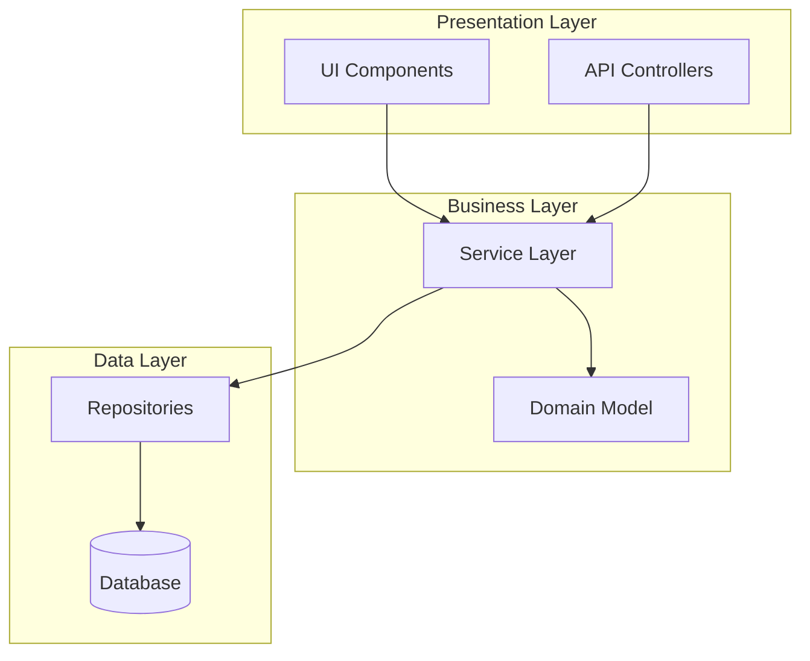
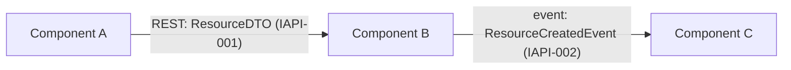
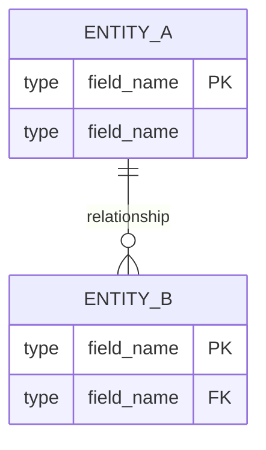
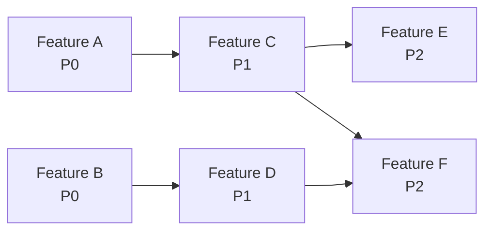

# <Project Name> — 设计文档（Design Document）

**日期（Date）**: YYYY-MM-DD
**状态（Status）**: Approved
**SRS 参考（SRS Reference）**: docs/plans/YYYY-MM-DD-<topic>-srs.md

## 1. 架构（Architecture）

### 1.1 架构概览（Overview）
[顶层系统描述：关键组件、各自职责、关键交互。1-3 段。]

### 1.2 逻辑视图（Logical View）

[描述系统如何分解为 package/module/layer。展示主要抽象及其依赖方向。]



[用项目实际的逻辑架构替换上述示例。]

### 1.3 组件图（Component Diagram）

[展示主要运行时组件及其交互。
 每条边**必须**包含：(1) 协议；(2) 引用 §4 Contract ID 的 schema 名称。]



[用实际组件与交互替换上述示例。缺少 Contract ID 标签的边即为设计缺陷 —— 需要补一行 §4，或说明其为框架级依赖（无运行期数据交换）。]

### 1.4 技术栈选型与方案论证（Tech Stack Decisions & Rationale）

[语言/框架/关键库的选择，精确版本或受约束区间（`1.2.3` / `^1.2.0` / `>=1.2,<2.0`；不得 `latest`）。
 每一项必须含一句**为何**：相对备选方案的权衡 + 对 SRS NFR 阈值的对齐。]

| Layer | Choice | Version | Why (NFR/Constraint Alignment) | Rejected Alternatives |
|-------|--------|---------|--------------------------------|----------------------|
| Language | [e.g. Python] | [3.11+] | [满足 NFR-001 启动延迟 + 团队技能栈] | [Node：NFR-003 单进程吞吐不足] |
| Web Framework | [e.g. FastAPI] | [0.110] | [async 支持满足 NFR-002 并发；自动 OpenAPI] | [Flask：同步阻塞] |
| Test Framework | [e.g. pytest] | [^7.4] | [生态 + coverage 工具] | — |

### 1.5 NFR 对齐摘要（NFR Alignment）
[本架构如何满足 SRS 每个"Must"NFR 的 1-3 行清单。]

## 2. Feature Integration Specs

> 每特性只写 Overview + Key Types + Integration Surface。**禁止**在本章画类图/时序图/流程图。

### 2.N Feature: <Feature Name> (FR-xxx)

#### 2.N.1 概览（Overview）
[1-2 句：做什么、满足哪些 SRS FR。]

#### 2.N.2 关键类型（Key Types）
[本特性引入或扩展的关键类/模块/实体清单，每行一项 + 一句职责。]

- `ClassName` — [一句职责，如 "owns user session lifecycle"]
- `AnotherType` — [一句职责]

#### 2.N.3 集成面（Integration Surface）

**Provides**（其他 feature 依赖本 feature）:

| Consumer Feature(s) | Contract ID | Endpoint / Method | Response Schema |
|---------------------|-------------|-------------------|----------------|
| [#M Feature B] | [IAPI-001] | [`GET /api/resource/:id`] | [`ResourceDTO`] |

**Requires**（本 feature 所依赖）:

| Provider Feature | Contract ID | Endpoint / Method | Request Schema |
|-----------------|-------------|-------------------|---------------|
| [#K Feature C] | [IAPI-002] | [`POST /api/other`] | [`OtherRequest`] |

[若该 feature 无跨 feature 依赖，写："Self-contained — no external integration surface."]

[对每个关键 feature 或 feature 组重复 2.N 子章节]

## 3. 数据模型（Data Model）

> **条件性**：若项目无持久化存储（纯无状态工具、library、CLI 过滤器），写 "[Not applicable — no persistent storage]" 并跳过。

[Schema、关系、存储策略。]



## 4. 内部 API 契约（Internal API Contracts）

[对 §1.3 组件图中每一对通过边相连的组件定义契约。]

| Contract ID | Provider Feature | Consumer Feature(s) | Endpoint / Method | Request Schema | Response Schema | Error Codes |
|-------------|-----------------|---------------------|-------------------|---------------|----------------|-------------|
| IAPI-001 | #N Feature A | #M Feature B, #K Feature C | `GET /api/resource/:id` | `{ id: UUID }` | `ResourceDTO { ... }` | 401, 404 |

[用 §1.3 边中实际的内部契约替换上述示例。]

**Schema 定义**（由上表引用）：

[使用项目主语言语法。定义表中引用的每个共享 schema。]

```
// Example — replace with actual schemas
interface ResourceDTO {
  id: string;
  name: string;
  created_at: string; // ISO 8601
}
```

**何时需要定义内部 API 契约：**
1. §1.3 中任意一对通过边相连的组件 → 必须对应一行
2. 若 feature A 的 `dependencies[]`（在 feature-list.json 中）包含 feature B，且 A 在运行期调用 B 的方法/API → 必须对应一行
3. 两个 feature 共享持久化状态（同一张 DB 表/文件/cache）→ 必须定义共享 schema
4. **不要求**：纯框架级依赖（例如 feature B 依赖 feature A 的项目骨架，但运行期无调用）

**粒度规则**：契约细化程度应使 Consumer 仅凭阅读此表即可独立编码 —— 即 Consumer 能写出正确的调用代码与错误处理。

## 5. 外部接口（External Interfaces）

> **条件性**：若 SRS 无 IFR-xxx（项目不对外暴露或调用第三方接口），写 "[Not applicable — no external interfaces]" 并跳过。

[对外部第三方系统的端点、契约、协议。每一行追溯到 SRS IFR-xxx。]

| IFR Trace | Direction | Endpoint / Protocol | Schema / Format | Auth | Error Handling |
|-----------|-----------|---------------------|-----------------|------|----------------|
| IFR-001 | Outbound | `POST https://api.vendor.com/v1/x` | JSON `{ ... }` | Bearer token | Retry 3× w/ backoff |

## 6. 任务分解与依赖链（Task Decomposition & Dependency Chain）

### 6.1 任务分解（Task Table）

> **填写说明**：每一行对应 `feature-list.json` 中的一个 feature。把经过 SRS G1-G6 + S1-S4 双向 sizing 校验后已获合理粒度的相关 FR 组合为纵向切片（vertical slice）。包含 Mapped FRs 以保证可追溯。每个 feature 应能在一次 Worker session 内有效完成（约占用模型上下文窗口 50%）。

| Priority | Feature | Mapped FRs | Dependencies | Rationale |
|---|---|---|---|---|
| P0 - Critical | [Feature A] | FR-001, FR-002 | None | Foundation required by all others |
| P1 - High | [Feature B] | FR-003, FR-004, FR-005 | A | Core value proposition |
| P2 - Medium | [Feature C] | FR-008, FR-009 | B | Extended functionality |
| P3 - Low | [Feature D] | FR-012 | None | Nice-to-have |

**优先级语义**：
- P0：Foundation —— 所有其他特性所需
- P1：Core value —— 最小可行特性集
- P2：Extended —— 重要但非发布阻塞
- P3：Nice-to-have —— 时间紧则延后

**配对特性排序**：当项目同时有后端与前端特性时，组织任务分解表使每个后端特性与其对应的前端特性配对（Backend A → Frontend A → Backend B → Frontend B）。Init 阶段据此排序 `feature-list.json` 中的特性。

### 6.2 依赖链（Dependency Chain）

[Mermaid 图展示关键路径与 feature 依赖顺序。]



**后端→前端依赖（全栈项目强制）**：依赖图**必须**显式展示后端 API feature 到消费它的前端 UI feature 的边。
示例：若 "User REST API" 是 Feature A、"User Profile Page" 是 Feature C，则图中必须出现 `A --> C`。
