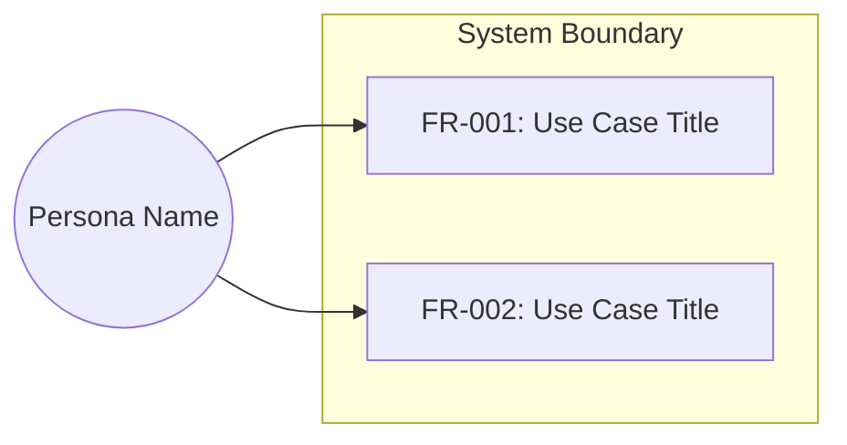

# <Project Name> — 软件需求规约（Software Requirements Specification）

**日期（Date）**: YYYY-MM-DD
**状态（Status）**: Approved
**参照标准（Standard）**: 对齐 ISO/IEC/IEEE 29148

## 1. 目的与范围（Purpose & Scope）
[待解决的核心问题；系统边界。]

### 1.1 范围内（In Scope）
[本版本将实现的内容]

### 1.2 范围外（Out of Scope）
[明确排除的内容 —— 延期或不计划实现]
[若在粒度分析过程中有需求被延期，在此引用延期待办清单（deferred backlog）：
"延期需求记录于 [deferred backlog](YYYY-MM-DD-<topic>-deferred.md)"]

### 1.3 问题陈述（Problem Statement）

**根因（5-Whys）**:
```
Symptom: [user-stated problem in their words]
Why 1: [first cause]
Why 2: [cause of Why 1]
Why 3: [deepest supported cause]
Root Cause: [systemic cause requirements must address]
```

**Jobs-to-be-Done**: When [situation], I want to [motivation], so I can [outcome].

**痛点图（Pain Map）**:
| Pain Point | Current Workaround | Frequency | Severity | Score |
|---|---|---|---|---|

**对齐校验（Alignment Validation）**: [PASS / PARTIAL / FAIL —— 由对齐校验步骤填入]

[不适用 —— Lite 通道或已完全规约的增量]

## 2. 术语与定义（Glossary & Definitions）
| 术语（Term） | 定义（Definition） | 切勿混淆于（Do NOT confuse with） |
|------|-----------|---------------------|
[每一个领域专属或易歧义的术语。若无，省略本节。]

## 3. 干系人与用户画像（Stakeholders & User Personas）
| Persona | Technical Level | Key Needs | Access Level |
|---------|----------------|-----------|--------------|
[若无 UI / 终端用户特性，省略本节]

### 3.1 用例视图（Use Case View）



[若不存在面向用户的功能需求，省略本节]

## 4. 功能需求（Functional Requirements）

### FR-001: <Title>
**优先级（Priority）**: Must
**EARS**: When <trigger>, the system shall <action>.
**可视化输出（Visual output）**（若为 UI 面向）: [一句话：用户会看到什么变化。例如："蛇在游戏面板上的位置在每个 tick 后可视化更新。" 若该 FR 无用户可见输出，写 "N/A — backend-only"。]
**验收准则（Acceptance Criteria）**:
- Given <context>, when <action>, then <expected result>
- Given <error context>, when <action>, then <error handling>

[对每条功能需求重复上述结构]

### 4.1 流程图（Process Flows）

[每个含 3 个以上步骤或包含分支逻辑的功能领域配一张流程图 —— 在 Step 4c 生成]

#### Flow: <Workflow Name>


[为每个独立的功能领域增加一个 #### Flow 子节]
[若所有需求都是单步、无分支，省略本节]

## 5. 非功能需求（Non-Functional Requirements）
| ID | Category (ISO 25010) | Requirement | Measurable Criterion | Measurement Method |
|----|---------------------|-------------|---------------------|-------------------|
| NFR-001 | Performance | Response time | p95 < 200ms | Load test with k6 |
[若不适用，写 "None identified" 并说明原因]

## 6. 接口需求（Interface Requirements）
| ID | External System | Direction | Protocol | Data Format |
|----|----------------|-----------|----------|-------------|
| IFR-001 | Payment Gateway | Outbound | REST/HTTPS | JSON |
[若无外部接口，省略本节]

## 7. 约束（Constraints）
| ID | Constraint | Rationale |
|----|-----------|-----------|
| CON-001 | Must run on Python 3.8+ | Corporate standard |
[若无，写 "None identified"]

## 8. 假设与依赖（Assumptions & Dependencies）
| ID | Assumption | Impact if Invalid |
|----|-----------|------------------|
| ASM-001 | JWT validation handled by API Gateway | Business layer must add validation |
[若无，写 "None identified"]

## 9. 验收准则汇总（Acceptance Criteria Summary）
[将每条 FR/NFR 与其 pass/fail 准则关联的整合表或列表]

## 10. 可追溯矩阵（Traceability Matrix）
| Requirement ID | Source (stakeholder need) | Pain Point Addressed | Verification Method |
|---------------|-------------------------|---------------------|-------------------|
| FR-001 | User story: "As a user, I want to..." | [Pain Map row label or "None — new capability"] | Automated test |
[每条需求都必须出现在此矩阵中]

## 11. 遗留问题（Open Questions）
[任何需要在设计阶段解决的项。若无，写 "None"。]
