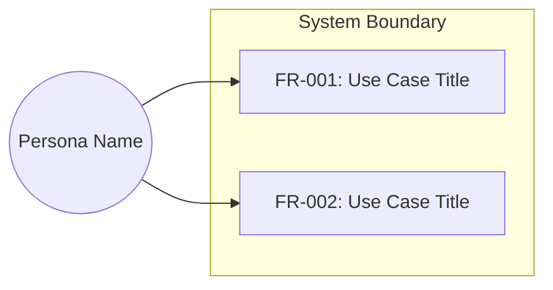
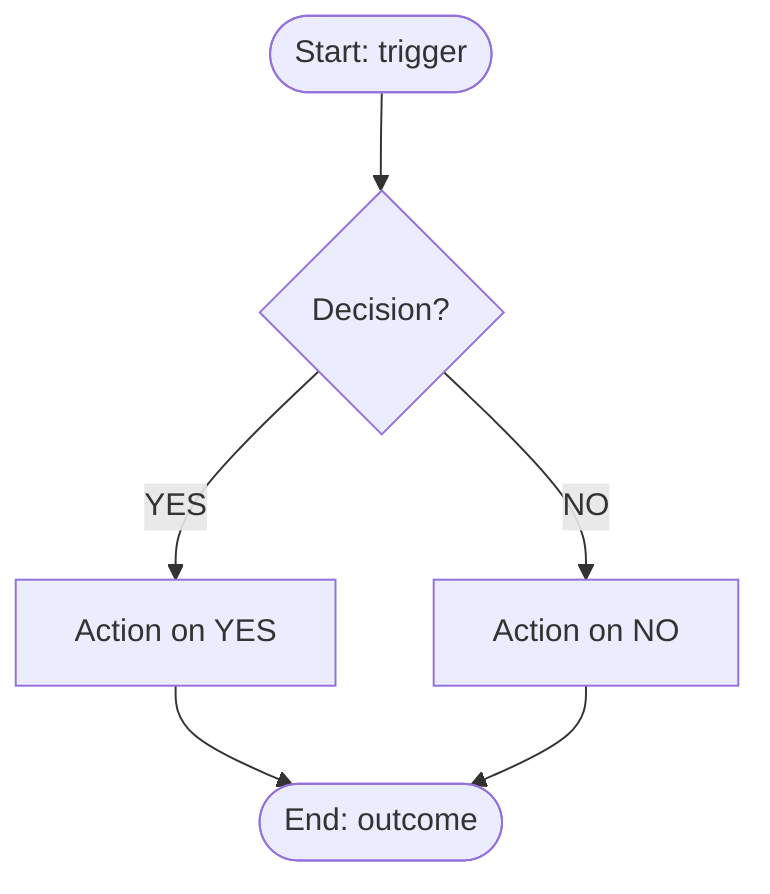

# <Project Name> — 软件需求规格说明书

**日期**: YYYY-MM-DD
**状态**: 已批准
**标准**: 对齐 ISO/IEC/IEEE 29148

## 1. 目的与范围
[要解决的核心问题。系统边界。]

### 1.1 范围内
[本版本系统将要完成的内容]

### 1.2 范围外
[明确排除的内容 -- 延期或不在计划内]
[如果在粒度分析过程中有需求被延期，请引用延期积压清单：
"延期需求记录在 [延期积压清单](YYYY-MM-DD-<topic>-deferred.md) 中"]

### 1.3 问题陈述

**根因分析（5-Whys）**:
```
Symptom: [user-stated problem in their words]
Why 1: [first cause]
Why 2: [cause of Why 1]
Why 3: [deepest supported cause]
Root Cause: [systemic cause requirements must address]
```

**待完成任务（Jobs-to-be-Done）**: 当 [情景] 时，我希望 [动机]，以便 [期望结果]。

**痛点地图**:
| 痛点 | 当前替代方案 | 频率 | 严重程度 | 评分 |
|---|---|---|---|---|

**对齐验证**: [PASS / PARTIAL / FAIL -- 由对齐验证步骤填写]

[不适用 -- Lite 路径或完全指定的增量]

### 1.4 存量系统上下文 (ESI)
[仅适用于存量系统项目。新建项目 §1.4.1 标记"[不适用]"；§1.4.2 为空表；§1.4.3 省略整节。]

#### 1.4.1 模块清单与变更范围

**变更类型**: [新增能力 / 修改现有 / 替换现有 / 扩展现有]

**存量系统清单**:
| 维度 | 现有实现 | 本次变更影响 |
|------|---------|------------|

**变更摘要**: [1-3 句话：什么变了、什么不变]
**涉及模块**: [本次变更涉及的现有模块/目录]
**不涉及模块**: [不受影响的关键模块]

#### 1.4.2 Legacy Context Decisions (LCD)

从用户原始需求文档抽取的存量语义约束（业务行为契约、兼容性、数据语义、性能基线）。每条为一等公民，下游 feature-design / TDD 必须硬读。

**类别枚举**（固定 5 种）：
- `BEHAVIOR` — legacy 业务行为契约（原系统怎么做的）
- `COMPAT` — 对外兼容性（接口 / 编码 / 返回码）
- `DATA` — 数据字段/编码/取值空间
- `PERF` — 性能 / 吞吐 / 响应时间基线
- `RATIONALE` — 仅解释 why（不产生执行约束；下游不验证）

**权威字段**：
- `RESOLVED` — 澄清结论已覆盖原文，以本列决议为准
- `QUOTED` — 原文未改动直接采纳
- `CONFLICTED` — 原文 vs 澄清未决；CONFLICTED > 0 阻塞 SRS 审查门

**ID**：`LCD-001` 三位零填充，与 FR/NFR/IFR 对齐；DEPRECATED 不复用 ID。

| LCD-ID | 类别 | 原文依据 | 澄清决议 | 权威 | 影响 FR/CON | 状态 |
|--------|------|----------|----------|------|-------------|------|
| LCD-001 | BEHAVIOR | "§3 ¶2: ..." | [决议一句话] | RESOLVED | FR-005, FR-008 | ACTIVE |

**状态**：`ACTIVE` / `DEPRECATED`（失效理由写在"澄清决议"列）。
**空表规则**：新建项目或无显著存量约束，保留列头即可，整表 0 行。

#### 1.4.3 原始文档归档引用

[仅存量项目。归档由 requirements Step 1.7 自动完成。]

| 文件 | SHA256 | 导入日期 | 备注 |
|------|--------|----------|------|
| `docs/references/<original-filename>` | `abc123...` | YYYY-MM-DD | [简短说明] |

**权威分层**：§1.4.2 是执行权威；本节指向的原文仅作证据。下游 SubAgent 默认**不读**原文；仅在 `[LEGACY-DRIFT]` blocker 触发溯源时回查。若原文与 §1.4.2 矛盾，以 §1.4.2 为准。

## 2. 术语表与定义
| 术语 | 定义 | 勿与以下混淆 |
|------|-----------|---------------------|
[每个领域特定或有歧义的术语。若无则省略本节。]

## 3. 干系人与用户画像
| 画像 | 技术水平 | 关键需求 | 访问级别 |
|---------|----------------|-----------|--------------|
[若无 UI / 面向终端用户的功能则省略]

### 3.1 用例视图



[若不存在面向用户的功能需求则省略本节]

## 4. 功能需求

### FR-001: <标题>
**优先级**: Must
**EARS**: 当 <触发条件> 时，系统应 <执行动作>。
**验收标准**:
- 给定 <上下文>，当 <执行动作>，则 <预期结果>
- 给定 <错误上下文>，当 <执行动作>，则 <错误处理>

[对每个功能需求重复上述格式]

### 4.1 流程图

[针对包含 3 个以上步骤或分支逻辑的每个功能领域绘制一张流程图 -- 在 Step 4c 期间生成]

#### 流程: <工作流名称>



[为每个独立的功能领域添加额外的 #### 流程节]
[若所有需求都是单步且无分支则省略本节]

## 5. 接口需求
| ID | 外部系统 | 方向 | 协议 | 数据格式 |
|----|----------------|-----------|----------|-------------|
| IFR-001 | Payment Gateway | Outbound | REST/HTTPS | JSON |
[若无外部接口则省略]

## 6. 约束
| ID | 约束 | 依据 |
|----|-----------|-----------|
| CON-001 | Must run on Python 3.8+ | Corporate standard |
[若无，填写"未发现"]

## 7. 假设与依赖
| ID | 假设 | 若不成立的影响 |
|----|-----------|------------------|
| ASM-001 | JWT validation handled by API Gateway | Business layer must add validation |
[若无，填写"未发现"]

## 8. 验收标准汇总
[将每个 FR 与其通过/失败标准关联的汇总表或列表]

## 9. 可追溯性矩阵
| 需求 ID | 来源（干系人需求） | 对应痛点 | 验证方法 |
|---------------|-------------------------|---------------------|-------------------|
| FR-001 | User story: "As a user, I want to..." | [痛点地图行标签 或 "无 -- 新增能力"] | Automated test |
[每个需求都必须出现在此矩阵中]

## 10. 待解决问题
[需在设计阶段解决的所有事项。若无，填写"无"。]
