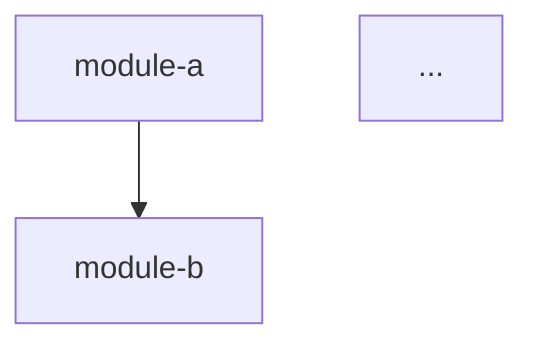
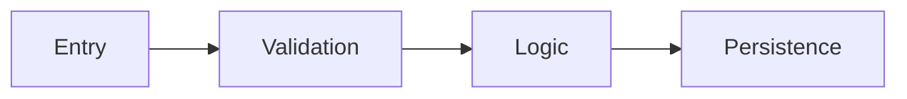
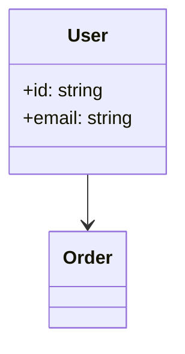

# 探索维度——执行指南

本文档为 6 个探索维度提供详细的分析指令。SubAgent（codebase-analyzer、codebase-pattern-finder）参考本指南以确保一致的、基于证据的分析。

**核心原则**：记录现状，而非应有之状。每个断言必须引用 `file:line`。

---

## 维度 1：架构概览

**处理者**：codebase-analyzer

### 分析内容

**模块分解**
- 通过目录结构识别顶层模块/包
- 对每个模块：名称、目录路径、大致文件数、主要职责（1 句话）
- 检测组织模式：按功能、按分层、按类型、混合

**架构模式检测**

| 模式 | 检测信号 |
|---------|-------------------|
| MVC | 目录命名为 `models/`、`views/`、`controllers/` 或框架等价物（Django views、Rails controllers、Spring @Controller） |
| 分层 | 明确分为 `presentation/`、`business/`/`service/`、`data/`/`repository/` 目录 |
| 六边形/整洁架构 | `ports/`、`adapters/`、`domain/`、`infrastructure/` 目录；领域边界处有接口 |
| 微服务 | 多个独立的 `service-*/` 目录，各自有独立的依赖清单 |
| 事件驱动 | 事件总线/发射器模式、消息队列消费者/生产者、发布-订阅 |
| 单体 | 单一部署单元、共享数据库、无服务边界 |
| 插件式 | 插件注册、钩子系统、扩展点 |

报告**主导模式**并附证据。如果有混合模式，报告主要 + 次要模式。

**模块依赖图**
- 追踪模块间导入（一个模块导入另一个模块）
- 生成 Mermaid `graph TD` 展示模块间依赖关系
- 识别扇入最高（被依赖最多）和扇出最高（依赖最多）的模块

**设计模式实例**
- 扫描常见模式：工厂、策略、观察者、仓储、单例、建造者、装饰器、中间件
- 对每个发现的模式：模式名称、file:line、简要证据（例如"工厂方法 `createUser()` 位于 `src/factories/user.ts:15`"）
- 仅报告有明确结构证据的模式；不进行推测

### 输出格式

```markdown
## Architecture Overview

### Module Decomposition
| Module | Path | Files | Responsibility |
|--------|------|-------|----------------|

### Architecture Pattern
**Primary**: [pattern] — [evidence summary]
**Secondary**: [pattern, if any] — [evidence summary]

### Module Dependency Graph


### Design Patterns Found
| Pattern | Location | Evidence |
|---------|----------|----------|
```

---

## 维度 2：入口点与 API 接口

**处理者**：codebase-analyzer

### 分析内容

**应用入口点**

| 语言 | 检测模式 |
|----------|-------------------|
| Python | `if __name__ == "__main__"`、`@click.command`、`@app.command`、`def main()`、setup.py/pyproject.toml 中的 `entry_points` |
| JavaScript/TypeScript | package.json 中的 `"main"`、package.json 中的 `"bin"`、Express/Fastify `app.listen()`、Next.js `pages/` 或 `app/` |
| Java | `public static void main(String[])`、Spring `@SpringBootApplication`、`@RestController` |
| Go | `func main()`、`http.ListenAndServe`、Cobra commands |
| Rust | `fn main()`、`#[tokio::main]`、Actix/Axum 路由设置 |
| C/C++ | `int main()`、`WinMain` |

对每个入口点：file:line、类型（CLI/HTTP/worker/定时任务）、简要描述。

**公开 API 接口**

| 框架 | 端点检测 |
|-----------|-------------------|
| Express/Fastify/Koa | `app.get/post/put/delete()`、`router.*()` |
| Django | `urlpatterns`、`@api_view` |
| Flask | `@app.route`、`@blueprint.route` |
| Spring | `@GetMapping`、`@PostMapping`、`@RequestMapping` |
| FastAPI | `@app.get/post`、`@router.*` |
| gRPC | `.proto` 文件中的 `service` 定义 |
| GraphQL | `type Query`、`type Mutation`、resolver 文件 |
| Go net/http | `http.HandleFunc`、`mux.Handle`、Gin/Chi 路由注册 |

对每个端点：方法、路径/名称、处理器 file:line、认证（如可检测）。

**配置面**
- 环境变量读取：`os.getenv`、`process.env.*`、`os.Getenv`、`std::env`
- 配置文件：`.env`、`config.yaml`、`application.properties`、`settings.py`
- 功能开关：任何 toggle/flag 模式

**插件/扩展点**
- 中间件链、事件钩子、插件注册表

### 输出格式

```markdown
## Entry Points & API Surface

### Entry Points
| Type | Location | Description |
|------|----------|-------------|

### API Endpoints
| Method | Path | Handler | Auth |
|--------|------|---------|------|

### Configuration
| Source | Key/File | Location | Description |
|--------|----------|----------|-------------|
```

---

## 维度 3：数据流与状态管理

**处理者**：codebase-analyzer

### 分析内容

**数据模型**

| ORM/框架 | 检测模式 |
|---------------|-------------------|
| SQLAlchemy | `class X(Base)`、`class X(db.Model)` |
| Django ORM | `class X(models.Model)` |
| TypeORM | `@Entity()`、`@Column()` |
| Prisma | `schema.prisma` 中的 `model X { ... }` |
| Mongoose | `new Schema({...})`、`mongoose.model()` |
| GORM | 带 `gorm` 标签的 struct |
| Protobuf | `.proto` 文件中的 `message X { ... }` |
| GraphQL | schema 文件中的 `type X { ... }` |

对每个模型：名称、file:line、关键字段（前 5 个）、与其他模型的关系。

**数据流路径**
- 至少追踪 1-2 个代表性请求路径：入口点 -> 校验 -> 业务逻辑 -> 持久化 -> 响应
- 为最重要的流程生成 Mermaid `flowchart LR`

**状态管理**
- 前端：Redux、Zustand、MobX、Vuex/Pinia、Svelte stores、React Context
- 后端：会话存储、内存缓存、无状态设计
- 数据库：SQL、NoSQL、键值、基于文件

**外部数据集成**
- API 客户端（HTTP、gRPC）、消息队列生产者/消费者、文件 I/O、云服务 SDK

### 输出格式

```markdown
## Data Flow & State Management

### Data Models
| Model | File | Key Fields | Relationships |
|-------|------|------------|---------------|

### Key Data Flow


### State Management
[Pattern description with evidence]

### External Data Integrations
| Integration | Type | File | Description |
|-------------|------|------|-------------|
```

---

## 维度 4：领域模型与业务逻辑

**处理者**：codebase-analyzer

### 分析内容

**核心领域实体**
- 区分实体（有标识、可变）与值对象（无标识、不可变）
- 识别聚合根（如果存在 DDD 模式）
- 为实体关系生成 Mermaid `classDiagram`

**业务规则与不变量**
- 强制业务约束的校验逻辑（不仅是类型校验）
- 与业务规则关联的授权/权限检查
- 计算逻辑（定价、评分、调度算法）
- 状态机转换（订单状态、工作流步骤）

**业务逻辑热点**
- 业务逻辑最密集的文件/函数（条件语句与总行数比例最高）
- 启发式方法：领域/业务/服务层中含有大量 `if/switch/case` 代码块的文件

**关键算法**
- 任何非平凡算法（排序、匹配、调度、优化）
- 对每个：名称/用途、file:line、实现方法简述

### 输出格式

```markdown
## Domain Model & Business Logic

### Domain Entities


### Business Rules
| Rule | Location | Description |
|------|----------|-------------|

### Key Algorithms
| Algorithm | File | Approach |
|-----------|------|----------|
```

---

## 维度 5：依赖与集成

**处理者**：codebase-pattern-finder

### 分析内容

**直接依赖清单**
- 解析依赖清单（package.json、requirements.txt、pyproject.toml、pom.xml、go.mod、Cargo.toml）
- 对每个依赖：名称、版本/约束、用途分类（HTTP、日志、测试、ORM、认证、校验、工具）
- 统计：运行时依赖总数、开发依赖总数

**内部模块耦合**
- 对每个模块目录统计：
  - **扇入**：有多少其他模块从它导入
  - **扇出**：它从多少其他模块导入
- 识别：耦合度最高的模块（高扇入 + 高扇出）、最孤立的模块

**外部服务集成**
- HTTP 客户端：基础 URL、API 客户端、SDK 实例化
- 数据库连接：连接字符串、连接池配置
- 消息队列：生产者/消费者配置
- 云服务：AWS/GCP/Azure SDK 使用

**依赖注入模式**
- DI 容器（Spring、Inversify、dig、wire）
- 手动装配（构造函数注入、工厂函数）
- 全局单例

### 输出格式

```markdown
## Dependencies & Integrations

### Dependency Summary
| Category | Count | Notable |
|----------|-------|---------|
| Runtime | N | [top 3 by importance] |
| Dev | N | [test framework, linter] |

### Internal Coupling
| Module | Fan-in | Fan-out | Coupling |
|--------|--------|---------|----------|

### External Services
| Service | Type | File | Connection |
|---------|------|------|------------|
```

---

## 维度 6：代码健康度与复杂度

**处理者**：codebase-pattern-finder

### 分析内容

**文件大小分布**
- 测量作用域内所有源文件的行数
- 报告：P50、P90、P99、最大值
- 列出前 5 个最大文件

**函数/方法长度**
- 启发式方法：统计函数/方法声明之间的行数
- 报告：P50、P90 估计值
- 列出前 5 个最长函数

**复杂度热点**
- 启发式方法：统计每个文件中的分支关键词（`if`、`else`、`elif`、`else if`、`for`、`while`、`switch`、`case`、`try`、`catch`、`except`、`&&`、`||`、`?:`、`match`）
- 按文件长度归一化：每 100 行的分支数
- 列出前 5 个最复杂文件

**测试覆盖率全景**
- 统计每个源码目录的测试文件数
- 计算测试与源码文件比例（按目录和总体）
- 识别零测试覆盖率的目录
- 从导入语句检测测试框架

**重复信号**
- 查找名称或结构非常相似的文件（例如 `userController.ts` / `orderController.ts` 具有相同结构）
- 查找重复代码块（相同函数签名或结构出现 3 次以上）
- 以观察方式报告，而非批评

**技术债务标记**
- 搜索：`TODO`、`FIXME`、`HACK`、`XXX`、`WORKAROUND`、`TEMP`、`DEPRECATED`
- 对每个：关键词、file:line、上下文（注释文本）
- 按关键词统计总数

### 输出格式

```markdown
## Code Health

### File Size Distribution
| Percentile | Lines |
|------------|-------|
| P50 | N |
| P90 | N |
| P99 | N |
| Max | N ([file]) |

### Complexity Hotspots
| File | Branches | Lines | Density |
|------|----------|-------|---------|

### Test Landscape
| Directory | Source Files | Test Files | Ratio |
|-----------|-------------|------------|-------|

### Technical Debt Markers
| Keyword | Count | Top Locations |
|---------|-------|---------------|
```
