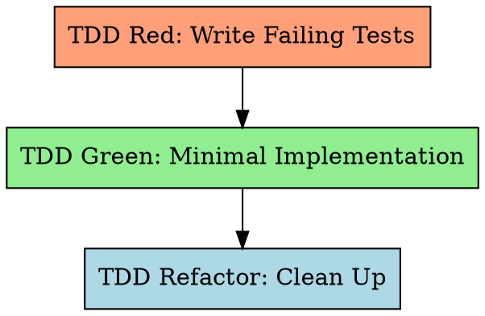

# Test-Driven Development for Long-Task

Write the test first. Watch it fail. Write minimal code to pass. Refactor.

**Violating the letter of the rules is violating the spirit of the rules.**

## The Iron Law

```
NO IMPLEMENTATION CODE WITHOUT A FAILING TEST FIRST
```

Write code before the test? Delete it. Start over. No exceptions.
- Don't keep it as "reference"
- Don't "adapt" it while writing tests
- Don't look at it
- Delete means delete

## Red-Green-Refactor Cycle



## Step 1: TDD Red — Write Failing Tests

Write tests for ALL rows in the Feature Design Test Inventory (§7). Tests MUST fail (feature not yet implemented).

### Specification Input

**Read the COMPLETE feature design document** (`docs/features/YYYY-MM-DD-<feature-name>.md`) cover to cover before writing any test. Do NOT selectively read sections — the document is an integrated whole where later sections depend on earlier context.

Key sections and their TDD role:
- **Existing Code Reuse** — utilities, API clients, data access patterns, §13.1 library usage examples from passing dependencies. Tests MUST use the same imports/patterns; implementation MUST REUSE/EXTEND items as marked.
- **Interface Contract (§3)** — method signatures, pre/postconditions, §13.1 library annotations ("Uses: ..."). Tests assert postconditions; implementation follows signatures exactly including library annotations.
- **Algorithm / Core Logic (§5)** — pseudocode, boundary matrix, error table, §13 library usage mapping. Tests cover boundaries (§5c) and errors (§5d); implementation follows pseudocode using §13-compliant libraries per §5e mapping.
- **Test Inventory (§7)** — PRIMARY test source. Each row maps to one or more test cases.

Supplementary (also mandatory):
- **SRS requirement section** (`{srs_section}`) — full FR-xxx with Given/When/Then acceptance criteria
- **Design doc §13** — test file naming per §13.5

When a test exercises a method annotated "Uses: [§13.1 library]" in the Interface Contract, the test setup should verify the correct library is used (e.g., mock/stub the §13.1 library, NOT the replaced alternative).

TDD rules (Rule 1–6) extend and refine the Test Inventory set. ST test case documents are generated *after* TDD as acceptance verification (Worker Step 9).

### Test Scenario Rules (hard requirements)

**Rule 1: Category Coverage** — tests must cover all applicable categories (using the same `MAIN/subtag` format as the Test Inventory):

| Category | What to test | Example |
|----------|-------------|---------|
| **FUNC/happy** | Normal operation, valid inputs | Valid login returns token |
| **FUNC/error** | Known failures, invalid inputs | Invalid password returns 401 |
| **BNDRY/\*** | Limits, empty, max, zero | Empty string; max-length password |
| **SEC/\*** | Injection, authorization (if applicable) | SQL injection in username |

When a category doesn't apply, state it explicitly in a comment:
```python
# SEC: N/A — internal utility with no user-facing input
```

**Rule 2: Negative Test Ratio >= 40%**

```
negative_test_count / total_test_count >= 0.40
```

A test is "negative" if it expects an exception, error, failure state, boundary/extreme input, unauthorized access, or malformed data.

**Rule 3: Assertion Quality — Low-Value <= 20%**

```
low_value_count / total_assertion_count <= 0.20
```

Low-value assertion patterns (avoid):
- `assert x is not None` without checking content
- `assert isinstance(x, SomeType)` without behavior check
- `assert len(x) > 0` without verifying elements
- `assert "key" in dict` without checking value
- `assert bool(x)` / truthiness only
- Import-only tests (`from module import X; assert X is not None`)

**Rule 4: The "Wrong Implementation" Challenge**

For each test, ask: "What wrong implementation would this test catch?"

If "almost any wrong implementation would still pass" → rewrite with more specific assertions.

**Interaction with Feature Detailed Design:** The boundary matrix (§5.3) and error table (§5.4) from the feature detailed design document provide pre-analyzed boundary values and error conditions. Use these as inputs when applying Rule 4 — they identify the "plausible wrong implementations" systematically rather than ad-hoc.

Imagine 2-3 plausible wrong implementations:
- Returns hardcoded value instead of computing
- Swaps two fields
- Off-by-one error
- Skips a validation step
- Returns stale/cached data

Would the test **fail** for each? If NO for most → rewrite.

**Rule 5: Test Layer Rule — Real Test Cases Required**

Each feature's automated tests MUST cover two layers. Both are mandatory:

| Layer | Purpose | Mock policy | Minimum |
|-------|---------|-------------|---------|
| **Unit (UT)** | Individual functions/classes | Mock only at system boundaries (external HTTP, third-party APIs, file system, clock); use real or in-memory implementations for internal logic | ≥ 1 test exercising core logic with real internal dependencies (no mocking internal components) |
| **Integration** | Components working against real infrastructure | NO mock for the primary dependency — use real test DB, real running service, or real file system | ≥ 1 test per feature that touches external systems |

**Integration test exception** — if the feature has absolutely no external dependencies (pure computation, no IO, no DB, no network):
- State explicitly in the test file:
  ```python
  # [no integration test] — pure function, no external I/O
  ```

**Label tests by layer** to enable feature-ST and ST report tracking:
```python
# [unit] — uses in-memory store
def test_user_validation_logic():
    ...

# [integration] — uses real test database
def test_user_persisted_to_db():
    ...
```

Reference: `testing-anti-patterns.md` Anti-Pattern #1 (mock only external services, not internal logic) and Anti-Pattern #3 (mock at system boundaries, not internal layers).

**Mandatory test writing order in TDD Red:**
1. Analyze Feature Design Test Inventory + {srs_section} (via `srs_trace`) + {design_section} to identify external dependencies
2. Write integration tests first — verify external dependency connectivity
3. Then write regular UT tests (happy path / error / boundary / security)
4. Run all tests → confirm all FAIL

### After Writing Tests

Run the test suite. **All tests must FAIL.** If any test passes → it tests nothing useful, rewrite it.

**Running tests**: Activate environment per `long-task-guide.md` → run test command directly. If tool is missing or environment not activated: diagnose root cause, run `init.sh` if needed, escalate to user if still failing. **Never skip.**

## Step 2: TDD Green — Minimal Implementation

Write ONLY enough code to make tests pass.

For subagent mode, dispatch with `skills/long-task-tdd/prompts/implementer-prompt.md` template:
- Provide FULL task text (don't make subagent read files)
- Include tech_stack, test command, coverage command, mutation command
- Include `CODEBASE_CONSTRAINTS` — populated from Design doc §13:
  - §13.1 table (mandatory internal libraries with import patterns)
  - §13.2 table (prohibited APIs with replacements)
  - §13.5 summary (naming conventions)
  - §13.6 summary (error handling pattern)
  Empty tables = "No constraints for this category."
- Include `EXISTING_CODE_REUSE` — populated from feature design "Existing Code Reuse" section:
  - All items with their Action (REUSE/EXTEND/PATTERN), file paths, and signatures
  - §13.1 Library Usage Examples table
- Exit criteria: all tests pass, no regressions

**Rules:**
- Implement fresh from tests — never reference pre-existing code that was "deleted" in the Iron Law
- One test at a time: make the simplest failing test pass first, then the next
- No premature optimization or extra features
- **Codebase constraints** (from Design doc §13):
  - §13.1: Use mandatory internal libraries — do NOT use replaced standard/3rd-party APIs
  - §13.2: Do not use prohibited APIs
  - §13.5: Follow documented naming conventions
  - §13.6: Follow documented error handling pattern
- **Existing code reuse** (from feature design "Existing Code Reuse" section):
  - Items marked **REUSE**: import and call directly — do NOT reimplement
  - Items marked **EXTEND**: subclass or extend — do NOT copy-paste
  - Items marked **PATTERN**: follow same structural pattern, create new implementation
  - §13.1 Library Usage Examples: use the exact import statement and call pattern from passing features

Write a TDD Red test that verifies the startup output contains these values before implementing the server binding. This enables reliable port/PID extraction via `head -30` of the startup log.

## Step 3: TDD Refactor

Clean up while keeping tests green:
- Extract duplication, improve naming, simplify
- Run tests after EVERY change (activate environment → run test command directly)
- No new functionality in this step
- **Static analysis gate** (if Design §13.4 lists tools): after refactoring is complete, run each tool's command (e.g., `npx eslint .`, `mvn checkstyle:check`, `mypy src/`). Fix all violations before exiting Refactor — violations are **blocking**. Tools read their own config; do not parse configs manually.

## Testing Anti-Patterns (Top 5)

1. **Testing mock behavior** — Verify real code, not mock configuration. If you assert on mock return values, you test the mock, not the system.
2. **Implementation detail testing** — Test behavior/output, not internal structure. Don't assert method call counts or internal state.
3. **Tests that can't fail** — Every assertion must be falsifiable. If removing the implementation still passes the test, it's worthless.
4. **Gaming coverage** — Assert-free tests exercise code without verifying correctness. Coverage ≠ quality.
5. **Low-value assertions** — `assertNotNull` / `isinstance` / `len>0` without checking actual values. Max 20% of total.

Full catalog: Read `skills/long-task-tdd/testing-anti-patterns.md`.

## Integration

**Called by:** long-task-work (Steps 6-8)
**Dispatches:** implementer subagent (`skills/long-task-tdd/prompts/implementer-prompt.md`)
**Requires:** Feature detailed design exists (from Work Step 4, via `long-task:long-task-feature-design`)
**Produces:** Passing tests + implementation code
**Chains to:** Quality Gates SubAgent (via Work Step 8)
