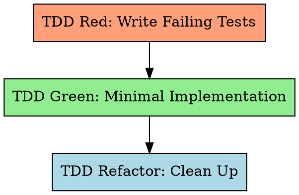

# Long-Task 的测试驱动开发（TDD）

先写测试，看它失败，写最小代码让它通过，再重构。

**违反规则的文字就是违反规则的精神。**

## SubAgent 分发模式

本 skill 由 `long-task-work-tdd` 以 **独立 SubAgent（全新上下文）** 方式分发。本 SubAgent 是 **orchestrator**，依次 DISPATCH 三个独立 SubAgent 分别执行 Red / Green / Refactor；每个子 SubAgent 返回自己的 Structured Return Contract，orchestrator **聚合**成统一契约返回给 `long-task-work-tdd`。主 Worker agent 只消费最终聚合契约，不消费三个子契约的原文。

嵌套深度：main → work-tdd → tdd(1) → {red/green/refactor}(2)，= depth 2。

## Input Contract & Self-Resolution

主 agent 传入的最小动态字段：

- `feature_id` —— 目标特性 ID
- `feature_list_path` —— `feature-list.json` 路径
- `feature_design_path` —— 上游 Feature Design 文档（`docs/features/YYYY-MM-DD-<slug>.md`）

orchestrator 启动后**解析一次**，解析结果用于组装 3 个 DISPATCH 的 input（避免各 sub-skill 重复 glob）：

1. 读 `{feature_list_path}`，取 `features[].id == feature_id` 得 feature 对象（`srs_trace` / `ui` / `category`）+ 根级 `tech_stack` / `quality_gates` / `real_test` / `required_configs`
2. Glob `docs/plans/*-srs.md` → `srs_doc_path`；`feature.srs_trace` 定位 FR/NFR/IFR 节作为 `{srs_section}`
3. Glob `docs/plans/*-design.md` → 定位 §2.N + §4.N 作为 `{design_section}`
4. Glob `env-guide.md` → §2 激活 / §3 测试-覆盖-静态 / §4 codebase constraints

sub-skill 内部会再次自行 glob（lessons §"一致性优先于去重"）；本 orchestrator 解析是为了把 `feature_design_path` 等关键路径清洗后入 DISPATCH input。

## 铁律

```
NO IMPLEMENTATION CODE WITHOUT A FAILING TEST FIRST
```

先写了实现？删掉。从头来。没有例外。
- 不要当作"参考"留下
- 不要边写测试边"改编"它
- 不要看它
- 删除就是删除

## R-G-R 流程



## 共享资产

- **Structured Return Contract**：`../long-task-work/references/structured-return-contract.md`（5 字段统一契约）
- **审批-返工循环**：`../long-task-work/references/approval-revise-loop.md`（fail → Failure Addendum 2 轮封顶；blocked → Clarification Addendum 不计入；TDD 内部无用户审批闸门，escalate 转为 orchestrator 级 `blocked` 返 work-tdd）
- **契约—实现漂移协议**：`references/drift-protocol.md`（Green / Refactor 共享）
- **静默执行协议**：`references/silent-execution.md`（三阶段共享）

## Step 1: TDD Red

> **DISPATCH** → 启动独立 SubAgent 执行 skill `long-task-tdd-red`
> **input**: `feature_id`, `feature_list_path`, `feature_design_path`
> **expect**: Structured Return Contract；`next_step_input` 含 `feature_test_files[]` / `test_count` / `all_failed` / `categories_covered[]` / `negative_ratio` / `real_test_count` / `low_value_ratio`

按 `../long-task-work/references/approval-revise-loop.md` 处理：
- `status: fail` → Failure Addendum 重分发（计入 2 轮上限；超限 → 转 blocked 返 work-tdd）
- `status: blocked` 带 `[SRS-*]` / `[ENV-ERROR]` / `[INSUFFICIENT_EVIDENCE]` → Clarification Addendum 重分发（不计入上限）
- `status: pass` → 进入 Step 2

## Step 2: TDD Green

> **DISPATCH** → 启动独立 SubAgent 执行 skill `long-task-tdd-green`
> **input**: `feature_id`, `feature_list_path`, `feature_design_path`, `feature_test_files`（从 Step 1 next_step_input）, `test_count`
> **expect**: Structured Return Contract；`next_step_input` 含 `impl_files[]` / `all_tests_pass` / `design_alignment: {§4, §6, §8, drift}` / `env_guide_synced`

按 `../long-task-work/references/approval-revise-loop.md` 处理：
- `status: fail` → Failure Addendum 重分发（计入 2 轮上限）
- `status: blocked` 带 `[CONTRACT-DEVIATION]` → **直接转 blocked 返 work-tdd**（需用户裁决；orchestrator 不自行裁决）
- `status: blocked` 带 `[SRS-*]` / `[ENV-ERROR]` → Clarification Addendum 重分发
- `status: pass` → 进入 Step 3

## Step 3: TDD Refactor

> **DISPATCH** → 启动独立 SubAgent 执行 skill `long-task-tdd-refactor`
> **input**: `feature_id`, `feature_list_path`, `feature_design_path`, `feature_test_files`, `impl_files`（从前两步）
> **expect**: Structured Return Contract；`next_step_input` 含 `static_analysis_ok` / `static_tool` / `static_violations` / `design_alignment_final` / `tests_still_pass`

按 `../long-task-work/references/approval-revise-loop.md` 处理：
- `status: fail` → Failure Addendum 重分发
- `status: blocked` 带 `[CONTRACT-DEVIATION]` → 转 blocked 返 work-tdd
- `status: blocked` 带 `[ENV-ERROR]` → Clarification Addendum 重分发
- `status: pass` → 进入聚合

## 聚合 Structured Return Contract

三步全部 pass 后，orchestrator 组装统一契约返回 `long-task-work-tdd`：

```markdown
## SubAgent Result: long-task-tdd

**status**: pass
**artifacts_written**: [Red 的 test files ∪ Green 的 impl files ∪ Refactor 中被修改的文件；去重]
**next_step_input**: {
  "feature_test_files": <from Red>,
  "all_tests_pass": <from Green>,
  "test_count": <from Red>,
  "red_green_refactor_complete": true
}
**blockers**: []
**evidence**: [
  "Red: <N> tests written, categories=<...>, negative_ratio=<...>, all FAILED",
  "Green: all <N> tests PASS after minimal implementation",
  "Design alignment verified: §4=<matches|updated:…>, §6=<…>, §8=<…>; drift=<none|resolved>",
  "Refactor: static analysis clean (tool=<…>, 0 violations); tests still green"
]
```

任一步最终为 `fail` / `blocked`（超轮次或 `[CONTRACT-DEVIATION]`）→ orchestrator 返回同状态，`blockers` 聚合所有子步阻塞条目，`artifacts_written` 列出至此已产出的文件，`evidence` 附最后一次失败现场。

## 失败 / 阻塞条件聚合

| 来源 step | 前缀 | 处置 |
|-----------|------|------|
| Red / Green / Refactor | `[ENV-ERROR]` | Clarification 重分发；反复失败转 escalate |
| Red / Green | `[SRS-VAGUE]` / `[SRS-DESIGN-CONFLICT]` / `[SRS-MISSING]` | Clarification 重分发；无法本地解决转 blocked 返 work-tdd |
| Red | `[INSUFFICIENT_EVIDENCE]` | Clarification（提供诊断路径） |
| Green / Refactor | `[CONTRACT-DEVIATION]` | **直接转 blocked 返 work-tdd**；orchestrator 不尝试 Clarification（需跨 Step 决策） |

## IMPORTANT

**不要**在 `feature-list.json` 中把特性标记为 `"passing"` —— 那是 `long-task-work-tdd` Step 5 Persist 的职责。本 SubAgent 只返聚合契约。
