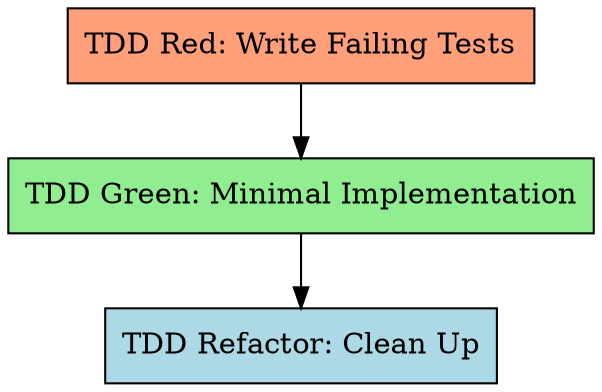

# Long-Task 的测试驱动开发（TDD）

先写测试，看它失败，写最小代码让它通过，再重构。

**违反规则的文字就是违反规则的精神。**

## SubAgent 分发模式

本 skill 由 `long-task-work` Step 5-7 以 **独立 SubAgent（全新上下文）** 方式分发。SubAgent 加载此 SKILL.md，一次性完成 Red → Green → Refactor 循环，并在文档末尾返回 **Structured Return Contract**。主 Worker agent 不消费 TDD 的中间输出 —— 只消费最终契约。契约定义见 `skills/long-task-work/references/structured-return-contract.md`。

## 铁律

```
NO IMPLEMENTATION CODE WITHOUT A FAILING TEST FIRST
```

先写了实现？删掉。从头来。没有例外。
- 不要当作"参考"留下
- 不要边写测试边"改编"它
- 不要看它
- 删除就是删除

## Red-Green-Refactor 循环



## Step 1: TDD Red —— 编写失败测试

针对特性详细设计中测试清单（§7）的每一行编写测试。测试**必须**失败（特性尚未实现）。

### 规约输入

测试由三大来源驱动：
- **特性详细设计测试清单**（`docs/features/YYYY-MM-DD-<feature-name>.md` §7）—— 主要测试来源；每一行映射到一个或多个测试用例
- **SRS 需求章节**（`{srs_section}`）—— 完整的 FR-xxx，含 Given/When/Then 验收标准、边界条件与错误路径（通过特性的 `srs_trace` 字段定位）
- **特性详细设计**（`docs/features/YYYY-MM-DD-<feature-name>.md`）—— 接口契约、实现摘要 + 边界条件，以及测试清单

编写测试文件时，若 `env-guide.md §4` 存在，遵循 §4.3 代码样式基线中的测试文件命名规范。

特性详细设计中的测试清单是 TDD Red 的**主要来源**。每行映射到一个或多个测试用例。TDD 规则（Rule 1–6）对该集合进行扩展与细化。SRS 验收标准（来自特性 `srs_trace` 引用的需求）提供补充上下文。ST 测试用例文档在 TDD 之后作为验收验证生成（Worker Step 9）。

### 测试场景规则（硬性要求）

**Rule 1: 分类覆盖** —— 测试必须覆盖所有适用分类（使用与测试清单相同的 `MAIN/subtag` 格式）：

| 分类 | 测试内容 | 示例 |
|----------|-------------|---------|
| **FUNC/happy** | 正常操作、有效输入 | 合法登录返回 token |
| **FUNC/error** | 已知失败、无效输入 | 错误密码返回 401 |
| **BNDRY/\*** | 边界、空值、最大值、零 | 空字符串；最大长度密码 |
| **SEC/\*** | 注入、授权（如适用） | 用户名中的 SQL 注入 |
| **INTG/\*** | 与真实基础设施交互（DB、API、文件系统） | DB 连接失败；错误的 API 端点；未处理超时 |

当某一类不适用时，在注释中显式说明：
```python
# SEC: N/A — internal utility with no user-facing input
```

**Rule 2: 负向测试比例 >= 40%**

```
negative_test_count / total_test_count >= 0.40
```

当测试期望异常、错误、失败状态、边界/极端输入、未授权访问或畸形数据时，即为"负向"测试。

**Rule 3: 断言质量 —— 低价值断言 <= 20%**

```
low_value_count / total_assertion_count <= 0.20
```

低价值断言模式（应避免）：
- 仅 `assert x is not None` 不检查内容
- `assert isinstance(x, SomeType)` 不校验行为
- `assert len(x) > 0` 不验证元素
- `assert "key" in dict` 不检查取值
- `assert bool(x)` / 仅真值断言
- 仅导入测试（`from module import X; assert X is not None`）

**Rule 4: "错误实现"挑战**

对每个测试反问："什么样的错误实现会被这个测试捕捉到？"

若"几乎任何错误实现都还能通过" → 用更具体的断言重写。

**与特性详细设计的交互：** 实现摘要内的边界条件表、以及接口契约中的 Raises 列，提供了事先分析过的边界值与错误条件。应用 Rule 4 时用它们作为输入 —— 它们系统性地识别"可能的错误实现"，而不是临时拼凑。

设想 2-3 种可能的错误实现：
- 返回硬编码值而不是计算
- 两个字段交换
- off-by-one 错误
- 跳过校验步骤
- 返回陈旧/缓存数据

对每种情况，测试是否都会 **失败**？若多数为"否" → 重写。

**Rule 5: 测试层级规则 —— 必须有真实测试**

每个特性的自动化测试**必须**覆盖两层。两者都是强制的：

| 层级 | 目的 | Mock 策略 | 最低要求 |
|-------|---------|-------------|---------|
| **单元测试（UT）** | 单个函数/类 | 仅在系统边界处 mock（外部 HTTP、三方 API、文件系统、时钟）；内部逻辑使用真实或内存实现 | ≥ 1 个测试，使用真实内部依赖覆盖核心逻辑（不对内部组件做 mock） |
| **集成测试** | 组件对真实基础设施运行 | 对主要依赖**不得** mock —— 使用真实测试 DB、真实运行的服务或真实文件系统 | 每个特性 ≥ 1 个接触外部系统的测试 |

**测试清单中的 INTG 行：** 当特性详细设计测试清单（§7）包含 `INTG/*` 分类的行时，这些就是 TDD Red 中集成测试的**主要规约**。每个 INTG 行映射到一个真实集成测试 —— 对主要依赖不得 mock。TDD Rule 5a（Real Test Standalone）校验适用于这些测试。

**集成测试豁免** —— 若特性绝对无外部依赖（纯计算、无 IO、无 DB、无网络）：
- 在测试文件中显式声明：
  ```python
  # [no integration test] — pure function, no external I/O
  ```

**按层级标注测试**，以便 feature-st 与 ST 报告跟踪：
```python
# [unit] — uses in-memory store
def test_user_validation_logic():
    ...

# [integration] — uses real test database
def test_user_persisted_to_db():
    ...
```

参考：`testing-anti-patterns.md` 反模式 #1（仅对外部服务 mock，不对内部逻辑 mock）与反模式 #3（仅在系统边界 mock，不在内部层次 mock）。

**TDD Red 中强制的测试编写顺序：**
1. 分析特性详细设计测试清单 + {srs_section}（通过 `srs_trace`）+ {design_section}，识别外部依赖
2. **先写 Real Tests**（见 Rule 5a）—— 验证外部依赖连通性
3. 然后写常规 UT（happy path / error / boundary / security）
4. 运行全部测试 → 确认全部 FAIL

**Rule 5a: Real Test 独立章节（强制）**

每个有外部依赖的特性在测试文件中必须有可识别的 real test。具体标记机制由项目语言与测试框架决定（记录在 `long-task-guide.md` Real Test Convention 章节 —— 指向 `env-guide.md` §3 获取精确运行命令），但**必须**满足以下不变量：

| 不变量 | 说明 |
|-----------|-------------|
| **可发现** | Real test 必须能通过 `feature-list.json` 的 `real_test.marker_pattern`，由 `check_real_tests.py` 发现 |
| **可隔离运行** | Real test 必须能与常规 UT 独立运行（通过标记过滤、目录分离或命名规范） |
| **主依赖不 mock** | Real test 主体对其验证的主要外部依赖**不得** mock；`real_test.mock_patterns` 定义可检测的 mock 关键字 |
| **高价值断言** | **不得**仅校验"无异常"；必须断言实际返回值、状态变化、数据持久化 |
| **不得静默跳过** | Real test 在依赖不可用时**必须**失败（而非跳过或提前返回）；使用 `assert env_var, "..."`，而非 `if not env_var: return` |
| **测试基础设施** | 使用项目测试环境（.env.test、测试 DB、localhost 测试服务）—— 绝不使用生产资源 |

**每种外部依赖类型至少 1 个 real test：**

| 依赖类型 | Real test 验证内容 |
|-----------------|-------------------|
| 配置 / 密钥 | 能从真实配置文件 / 环境变量读取值 |
| 数据库 / 存储 | 能连接真实测试 DB，执行读写 |
| 文件系统 | 能读写真实文件（不仅仅是 trivial 的 tmp_path） |
| HTTP / 网络 | 能向真实测试服务器发请求并获得响应 |
| 三方 SDK | 能调用 sandbox / 测试环境 API |

**纯函数豁免**：若特性无外部依赖（纯计算、无 I/O），在测试文件注释中显式声明，并在 Gate 0 由 {design_section} 确认。

**验证**：`python scripts/check_real_tests.py feature-list.json` —— 机械扫描 + grep，非 LLM 自检。

参考：`testing-anti-patterns.md` 反模式 #15（全 mock real test / mock 标签掩饰）与反模式 #16（静默跳过 / 环境守卫旁路）。

**Rule 6: UI 专属测试规则**（当 `"ui": true`）

- **UI 先决条件（在第一个 [devtools] 步骤之前校验）：**
  在任何 Chrome DevTools MCP 测试之前，确认应用可达：
  1. 若开发服务器未运行，启动它 —— 读取 `env-guide.md` 并使用该服务的启动命令，同时捕获输出：
     ```bash
     [start command from env-guide.md] > /tmp/svc-<slug>-start.log 2>&1 &
     sleep 3
     head -30 /tmp/svc-<slug>-start.log   # extract PID and port
     ```
     在 `task-progress.md` 中记录 PID。若本会话中已记录 PID，先运行健康检查 —— 若已在运行则跳过重启。
  2. 使用 `navigate_page` 访问特性的 `ui_entry` URL（或默认 localhost URL）
  3. 若连接被拒或页面报错（ERR_CONNECTION_REFUSED 等）→ 应用未运行。不要继续 UI 测试，诊断并修复启动问题。绝不跳过 UI 校验。
- 每个 `[devtools]` 步骤必须使用 EXPECT/REJECT 格式：
  ```
  [devtools] <page-path> | EXPECT: <positive criteria> | REJECT: <negative criteria>
  ```
- 通过 `evaluate_script()` 执行自动化错误检测脚本
- `list_console_messages(types=["error"])` 必须返回 0 个错误（除非 `[expect-console-error: <pattern>]`）

完整检测脚本与集成流程见 `references/ui-error-detection.md`。

**Rule 7: 正向渲染验证**（当 `"ui": true`）

Rule 6 检测 UI **错误**（渲染损坏）。Rule 7 验证 UI **存在性**（必须存在却未出现的元素）。

对测试清单（§7）中每一行 `UI/render` 行，编写测试：

1. **触发**渲染条件（页面加载、游戏开始、状态变化）
2. 通过 `evaluate_script()` **断言正向存在**：
   - **Canvas 2D**：通过 `getImageData()` 校验 canvas 在预期区域存在非透明像素，或校验渲染函数被以预期参数调用
   - **WebGL**：在 WebGL 上下文使用 `readPixels()`（不能用仅适用于 Canvas 2D 的 `getImageData()`）
   - **DOM 方式**：`querySelector(selector)` 返回非空，`getBoundingClientRect()` 返回 width > 0 且 height > 0，`getComputedStyle(el).display !== 'none'`
   - **SVG 方式**：SVG 元素存在于 DOM 且具有非零包围盒
3. **断言内容正确性**（不仅仅是存在性）：
   - 元素数量与预期状态匹配（如蛇身有 N 段）
   - 元素内容反映数据源（如分数显示与游戏状态一致）
   - 视觉状态变体与逻辑状态匹配（如活着的蛇是绿色）
4. **断言交互深度**（不仅仅是显示）：
   - 若元素设计用于用户交互（游戏 canvas、表单、按钮、组件），至少编写一个触发交互并校验渲染输出变化的测试
   - Canvas 游戏：模拟按键 → 校验 canvas 像素发生变化（游戏状态前进）
   - 表单：填充输入 → 校验显示值；提交 → 校验响应已渲染
   - 组件：点击/拖动 → 校验视觉状态更新
   - 设计好的交互不响应的已渲染元素是**"display-only"缺陷** —— 渲染管线存在，但输入→渲染的接线断掉了

一个通过所有 Rule 6 检查（无错误）但没有渲染游戏内容的页面**必须**未通过 Rule 7。零错误的空白 canvas 不算通过的 UI。渲染了游戏画面却忽略键盘输入的 canvas 是 display-only 缺陷。

**最低要求**：每一行 `UI/render` 测试清单对应至少一个正向渲染测试。

可复用的正向渲染校验脚本见 `references/ui-error-detection.md` § Layer 1b。

**契约—实现漂移协议**：若在 TDD Green 中实现使用了与视觉渲染契约不一致的选择器、canvas ID 或组件结构：
1. 更新特性设计文档中的视觉渲染契约以匹配实际实现
2. 重新确认所有正向渲染断言仍有对应的 UI/render 测试清单行
3. 将更新后的契约与实现代码放在同一次 git 提交中
4. 理由：选择器不匹配会导致令人困惑的测试失败（错误的选择器，而非缺少渲染）。让契约作为与现实保持一致的"活文档"。

### 写完测试之后

运行测试套件。**所有测试必须 FAIL**。若任一测试通过 → 它什么也没测，重写。

**运行测试 —— 静默执行协议（强制）**：
1. 按 `env-guide.md` §2 激活环境
2. 运行 `env-guide.md` §3 中以静默方式包装的测试命令：
   ```bash
   <test-cmd> > /tmp/ut-$$.log 2>&1; echo $? > /tmp/ut-$$.exit
   ```
3. 从 `/tmp/ut-$$.exit` 读取退出码：
   - **exit 0（测试通过）** → 在 TDD Red 中这是错误的（实现前测试应失败）；重写测试。在 TDD Green 中这是正确的；**不要**倾倒日志。
   - **非零（测试失败）** → 在 TDD Red 中是预期的；提取 `/tmp/ut-$$.log` 最后 30 行以确认失败原因正确（ImportError、AttributeError、预期值上的 AssertionError）。在 TDD Green 中是错误的；提取最后 100 行 + `grep -E "FAIL|ERROR|Exception" /tmp/ut-$$.log` 进行诊断。
4. **修复后的 Re-check**：**不要**重跑整个测试套件。仅按名称重跑失败的测试，使用项目的过滤语法（如 `pytest path::test_name`、`mvn -Dtest=ClassName#methodName test`、`npx vitest run path -t "name"`）。仅在 TDD Green 结束时跑一次全量套件确认。
5. **若工具/环境失败**：诊断根因，如需则运行 `init.sh`，仍失败则升级给用户。**绝不跳过**。

**Real Test 验证（进入 Green 之前）：**
运行 `python scripts/check_real_tests.py feature-list.json --feature {id}` 并确认：
1. Real test 数量 > 0（或已声明纯函数豁免）
2. 无 mock 警告（或 LLM 已评审并确认警告不在主要依赖上）
若脚本报 FAIL → 停止，先补齐 real test。

## Step 2: TDD Green —— 最小化实现

只写**刚好**能让测试通过的代码。

subagent 模式下使用 `skills/long-task-tdd/prompts/implementer-prompt.md` 模板分发：
- 提供完整任务文本（不要让 subagent 自己读文件）
- 包含 tech_stack、test command、coverage command
- 退出条件：所有测试通过，无回归

**规则：**
- 基于测试从零实现 —— 绝不参考在铁律中"删除"的原有代码
- 一次一个测试：先让最简单的失败测试通过，再处理下一个
- 无过早优化或额外特性
- **存量代码库约束**（若 `env-guide.md §4` 存在）：
  - §4.1：使用强制内部库 —— **不要**使用被替换的标准 / 三方 API
  - §4.2：不得使用禁用 API
  - §4.3：遵循既定命名与错误处理模式

**启动输出要求** —— 对任何实现服务器进程或后台服务的特性：
实现必须在启动时输出：
- 绑定端口：如 `Starting server on port 8080`
- PID：如 `PID: 12345`
- 就绪信号：如 `Server ready`

在实现服务器绑定之前，先写一个 TDD Red 测试验证启动输出包含这些值。这样才能通过启动日志的 `head -30` 可靠地提取端口/PID。

**env-guide.md 同步规则** —— 实现或修改服务器/后台服务后：
1. 将实际启动命令与绑定端口对比 `env-guide.md` 的 "Start All Services" 与 Services 表
2. 若不一致（端口变了、命令改名、新增了服务）：更新 `env-guide.md` —— 修正 Services 表行以及 Start/Stop/Verify 命令以一致
3. 若启动顺序需要 >2 条 shell 命令（如 DB migration + seed + server）：抽取到 `scripts/svc-<slug>-start.sh`（Unix）/ `scripts/svc-<slug>-start.ps1`（Windows）；更新 env-guide.md 的 "Start All Services" 调用 `bash scripts/svc-<slug>-start.sh`；停止顺序同理
4. 将所有 `env-guide.md` 与 `scripts/svc-*` 的变更与实现放在 **同一次 git 提交**

## Step 3: TDD 重构

保持测试为绿的同时清理代码：
- 抽取重复，改进命名，简化
- 每次改动后以**静默执行**运行测试（见 Step 1 的 "After Writing Tests" 协议）。仅重跑触及改动文件的测试（不要跑全量）—— 重构全部完成后，做一次全量套件通过以确认无回归。
- 本步骤不引入新功能
- **静态分析关卡**（若 `env-guide.md §3` 列出了静态分析命令）：重构全部完成后，以静默执行运行每个工具的命令：
  ```bash
  <static-cmd> > /tmp/static-$$.log 2>&1; echo $? > /tmp/static-$$.exit
  ```
  读取退出码。非零时，用 `grep -E "error|warning" /tmp/static-$$.log` 提取违规项。退出重构之前修复全部违规 —— 违规是**阻塞性**的。工具自行读取配置；不要手动解析配置。

## 测试反模式（Top 5）

1. **测试 mock 的行为** —— 验证真实代码，而非 mock 配置。若你断言 mock 的返回值，那是测 mock，不是测系统。
2. **测试实现细节** —— 测行为/输出，不测内部结构。不要断言方法调用次数或内部状态。
3. **不可能失败的测试** —— 每条断言必须可被证伪。若删掉实现测试仍然通过，这个测试就是无价值的。
4. **为覆盖率凑数** —— 无断言的测试"执行"了代码但未验证正确性。覆盖率 ≠ 质量。
5. **低价值断言** —— `assertNotNull` / `isinstance` / `len>0` 不检查真实取值。最多占总数 20%。

15 条反模式完整清单：阅读 `skills/long-task-tdd/testing-anti-patterns.md`。

## Structured Return Contract

当完整的 Red → Green → Refactor 循环完成（或被阻塞）时，**严格**按以下格式返回结果：

```markdown
## SubAgent Result: long-task-tdd

**status**: pass | fail | blocked
**artifacts_written**: [test file paths, implementation file paths — all modified during this cycle, relative to project root]
**next_step_input**: {
  "feature_test_files": [test file paths for Quality Gate to measure],
  "all_tests_pass": true | false,
  "test_count": <total test count in this feature>,
  "red_green_refactor_complete": true | false
}
**blockers**: [one-sentence strings if status=blocked; otherwise empty array]
**evidence**: [
  "Red: N tests written, all failed as expected (example: test_login_valid_creds FAIL)",
  "Green: all N tests PASS after minimal implementation",
  "Refactor: static analysis clean (tool=<name>, 0 violations)"
]
```

**失败条件**（`status: fail`）：
- 经过 3 次 Green 尝试后测试仍无法通过
- 重构引入了无法修复的回归

**阻塞条件**（`status: blocked`）：
- 测试框架未安装 / 环境未初始化
- 规约歧义在无用户输入时无法解决（通过 CLARIFY 升级）
- 外部依赖不可用（数据库宕机、API 凭据缺失）

**IMPORTANT**：**不要**在 `feature-list.json` 中把特性标记为 `"passing"` —— 那是 Worker 在 Step 11 Persist 的职责。只在上述契约中汇报结果。
