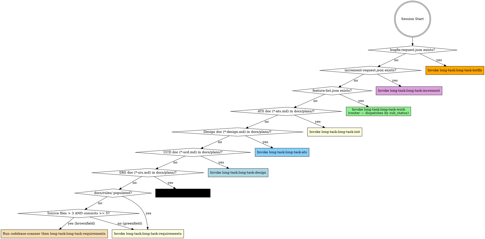

<EXTREMELY-IMPORTANT>
你正处于一个 long-task 多会话项目中。在任何响应或行动之前（包括澄清问题），你必须先调用正确的阶段 skill。

如果某个阶段 skill 适用，你没有选择。你必须使用它。

这不可谈判。这不是可选的。你无法通过任何理性化来逃避它。
</EXTREMELY-IMPORTANT>

## 如何访问 Skill

使用 `Skill` 工具按名称调用 skill（例如 `long-task:long-task-work`）。被调用时，skill 内容会加载并呈现给你——直接按其执行。永远不要对 skill 文件使用 Read 工具。

## 阶段检测

检查项目状态并调用对应的 skill：



**检测规则：**
0. 检查项目根目录下的 `bugfix-request.json` → 如果存在 → `long-task-hotfix` **（最高优先级）**
   注意：如果 `bugfix-request.json` 和 `increment-request.json` 同时存在，hotfix 先执行；`increment-request.json` 被保留，下次会话处理。
1. 检查项目根目录下的 `increment-request.json` → 如果存在 → `long-task-increment`
2. 检查项目根目录下的 `feature-list.json` → 如果存在 → `long-task-work`（它是薄路由壳，内部按 `sub_status` 分发到 `work-design` / `work-tdd` / `work-st`，或在全部 `done` 时转 `long-task-st`，并在首次遇到缺 sub_status 时幂等运行 `migrate_sub_status.py`）。using-long-task 不在这一层做分桶判断——单源路由在 `long-task-work`。
3. 检查 `docs/plans/*-ats.md` → 如有匹配 → `long-task-init`（ATS 完成，进入 init）
4. 检查 `docs/plans/*-design.md` → 如有匹配 → `long-task-ats`（Design 完成，进入 ATS）
5. 检查 `docs/plans/*-ucd.md` → 如有匹配 → `long-task-design`（UCD 完成，进入 design）
6. 检查 `docs/plans/*-srs.md` → 如有匹配 → `long-task-ucd`（SRS 完成，下一步 UCD；如果没有 UI 特性，UCD skill 自动跳到 design）
7. 否则 → 检查存量代码库约定：
   a. 检查 `docs/rules/` —— 如存在且至少包含 1 个 `.md` 文件（排除全新项目占位）→ `long-task-requirements`（规则已扫描）
   b. 检查是否存在源文件（存量项目启发式）：统计源文件（`*.py`、`*.js`、`*.ts`、`*.java`、`*.c`、`*.cpp`、`*.go`、`*.rs` 等），排除 `.git/`、`node_modules/`、`venv/`、`dist/`、`build/`；并检查 `git rev-list --count HEAD`
      - 如果源文件数 > 3 且 git 提交数 ≥ 5 → **运行 codebase-scanner**（见下文 Phase 0-pre）→ 然后 `long-task-requirements`
      - 否则（全新项目）→ 创建 `docs/rules/README.md` 占位（"Greenfield — no conventions to extract"）→ `long-task-requirements`

## Skill 目录

### 阶段 Skill（根据上述检测调用其中一个）
| Skill | 阶段 | 时机 |
|-------|-------|------|
| `long-task:long-task-hotfix` | Hotfix | bugfix-request.json 存在（最高优先级）|
| `long-task:long-task-increment` | 阶段 1.5 | increment-request.json 存在 |
| `codebase-scanner` (SubAgent) | 阶段 0-pre | 无 SRS、无 rules 文档、源文件 > 3 —— 在需求阶段前扫描存量代码库 |
| `long-task:long-task-requirements` | 阶段 0a | 无 SRS、无设计文档、无 feature-list.json |
| `long-task:long-task-ucd` | 阶段 0b | SRS 存在、无 UCD 文档、无设计文档、无 feature-list.json |
| `long-task:long-task-design` | 阶段 0c | SRS + UCD 都存在（或无 UI 特性）、无设计文档、无 feature-list.json |
| `long-task:long-task-ats` | 阶段 0d | 设计文档存在、无 ATS 文档、无 feature-list.json |
| `long-task:long-task-init` | 阶段 1 | ATS 文档存在（或对微型项目自动跳过）、无 feature-list.json |
| `long-task:long-task-work` | 阶段 2 路由壳 | feature-list.json 存在——**using-long-task 唯一的后 init 出口**；内部按 sub_status 分发 |
| `long-task:long-task-work-design` | 阶段 2a | 由 `long-task-work` 路由壳按 `sub_status=design_pending` 分发（不由 using-long-task 直接调用）|
| `long-task:long-task-work-tdd` | 阶段 2b | 由 `long-task-work` 路由壳按 `sub_status=tdd_pending` 分发 |
| `long-task:long-task-work-st` | 阶段 2c | 由 `long-task-work` 路由壳按 `sub_status=st_pending` 分发 |
| `long-task:long-task-st` | 阶段 3 | 由 `long-task-work` 路由壳在全部特性 `sub_status=done` 时转发（系统级 ST）|

### 独立 Skill（独立调用——无流水线依赖）
| Skill | 用途 | 触发 |
|-------|---------|---------|
| `long-task:long-task-explore` | 存量代码库深度探索——架构、数据流、领域模型、API 表面、依赖、代码健康度 | 按需通过 `/deep-explore [quick\|standard\|deep] [--focus area] [--path dir]` 触发 |

### 专业 Skill（由 long-task-work-{design,tdd,st} 作为 SubAgent 调用——禁止直接调用）
| Skill | 用途 | 调用方 |
|-------|---------|-------|
| `long-task:long-task-feature-design` | Feature 详细设计——接口契约、算法伪代码、状态图、边界矩阵、测试清单 | `long-task-work-design` |
| `long-task:long-task-tdd` | TDD Red-Green-Refactor（R/G/R 均独立重读 feature design）| `long-task-work-tdd` |
| `long-task:long-task-quality` | 覆盖率关卡 | `long-task-work-tdd` |
| `long-task:long-task-feature-st` | 黑盒 Feature 验收测试——自管 start/cleanup 生命周期、Chrome DevTools MCP 执行、ISO/IEC/IEEE 29119 测试用例文档 | `long-task-work-st` |

### 元 Skill（由阶段 skill 按需调用——禁止直接调用）
| Skill | 用途 |
|-------|---------|
| `long-task:long-task-finalize` | ST 后文档——场景化使用示例生成 + RELEASE_NOTES/task-progress 收尾（在 ST Go 裁决后）|

## 关键文件（共享契约）

| 文件 | 角色 |
|------|------|
| `docs/plans/*-srs.md` | 已审批 SRS —— WHAT |
| `docs/plans/*-deferred.md` | 延后需求待办清单——下一轮经由 increment 捡起 |
| `docs/plans/*-ucd.md` | 已审批 UCD 样式指南—— LOOK（仅 UI 项目）|
| `docs/plans/*-design.md` | 已审批设计—— HOW |
| `docs/plans/*-ats.md` | 已审批 ATS —— 测试策略（需求→场景映射）|
| `feature-list.json` | 任务清单——中央共享状态 |
| `task-progress.md` | `## Current State` 头部（进度）+ 会话日志 |
| `long-task-guide.md` | 项目专属 Worker 指南 |
| `RELEASE_NOTES.md` | 活更新日志 |
| `docs/test-cases/feature-*.md` | 按特性的 ST 测试用例文档（ISO/IEC/IEEE 29119）|
| `docs/plans/*-st-report.md` | 系统测试报告—— Go/No-Go 裁决 |
| `bugfix-request.json` | 信号文件——触发 hotfix 会话（处理后删除）|
| `increment-request.json` | 信号文件——触发增量需求（处理后删除）|
| `docs/rules/*.md` | 存量代码库约定——编码风格、2/3方件约束、构建模式、commit 约定（仅存量项目）|

## 红旗信号

出现这些想法意味着停下——你在理性化逃避：

| 想法 | 现实 |
|---------|---------|
| "先看一下代码吧" | 先调用阶段 skill。它会告诉你如何定位。|
| "我知道该做哪个特性" | Worker skill 有 Orient 步骤。照着走。|
| "这个特性简单，跳过 TDD" | long-task-tdd 不可协商。|
| "测试通过了，可以标记完成" | 必须先通过 long-task-quality 关卡。|
| "我记得工作流" | Skill 在演化。通过 Skill 工具加载当前版本。|
| "我需要先获取更多上下文" | Skill 检查先于探索。|
| "先做这一件事再说" | 做任何事之前先检查。|
| "需求很明显，直接到设计" | long-task-requirements 会捕捉你会遗漏的内容。|
| "测试分类可以在 feature-st 期间决定" | 临时指派会导致 SEC/PERF 缺口。先运行 ATS。|
| "ATS 对这个项目来说过头了" | 查阅 Scaling Guide —— 微型项目会自动跳过 ATS。|
| "SRS 已经暗含了设计" | SRS = WHAT，design = HOW。两者都必需。|
| "UI 样式可以在编码期间决定" | 临时造型会导致不一致。先运行 UCD。|
| "这个 UI 太简单不需要样式指南" | 即便简单 UI 也需要 token。UCD 可以很轻量。|
| "所有特性都过了，可以发布" | 特性测试 ≠ 系统测试。先运行 ST 阶段。|
| "系统测试过头了" | 集成 bug、NFR 失败、工作流缺口会藏到 ST 才暴露。|
| "我直接往 JSON 里加特性就行了" | 调用 `long-task-increment` skill 进行可追踪、可审计的变更。|
| "需求变更很小，不需要影响评估" | Increment skill 会捕捉隐藏依赖。|
| "我直接把这个小 bug 修了吧" | 调用 `long-task-hotfix` —— bug 会被记录到 feature-list.json 为 category=bugfix，并走完整 Worker 流水线修复。|
| "Worker 期间生成示例吧" | 示例在 ST 之后通过 long-task-finalize 生成。|
| "我已经了解项目的约定了" | 运行 codebase-scanner。隐性知识不跨会话持久化。2/3方件约束很容易被漏掉。|
| "这个存量项目很小，不用扫描" | 自动跳过会处理全新项目（≤3 文件）。让 scanner 自己决定。|

## Skill 优先级

1. **阶段 skill 优先** —— 决定整个会话工作流
2. **专业 skill 其次** —— 由 Worker 按严格顺序调用（tdd → quality → st-case → review）
3. **出错时** —— 在做任何修复前遵循 `skills/long-task-work/references/systematic-debugging.md` 中的系统化调试方法

## Phase 0-pre：存量代码库约定扫描（仅存量项目）

当检测规则 7b 触发（存量项目、无现有 `docs/rules/`），在调用 `long-task-requirements` **之前**执行以下步骤：

1. **创建输出目录**：`mkdir -p docs/rules/`

2. **检测语言与框架**：分析文件扩展名和依赖清单（`package.json`、`requirements.txt`、`pom.xml`、`Cargo.toml`、`go.mod`、`*.csproj`）。决定扫描深度：
   | LOC 范围 | 深度 |
   |-----------|-------|
   | < 1,000 | 轻量（前 20 个文件）|
   | 1,000–10,000 | 标准（前 50 个文件）|
   | > 10,000 | 深度（前 100 + 所有 config）|

3. **分发 `codebase-scanner` SubAgent**：

   ```
   Agent(
     subagent_type="general-purpose",
     description="Scan codebase conventions for [project]",
     prompt="""
     Read the agent definition at: {plugin_root}/agents/codebase-scanner.md

     ## Scan Parameters
     - Working directory: {working_directory}
     - Primary language(s): {languages}
     - Primary framework(s): {frameworks}
     - Scan depth: {scan_depth}
     - Source file list: {file_list}

     Execute the full codebase scanner process per the agent definition.
     Return structured output per the Structured Return Contract.
     """
   )
   ```

4. **校验结果**：确认 `docs/rules/` 下至少存在 1 个输出文件。如果 SubAgent 返回 BLOCKED，写入最小占位（非阻塞——扫描是尽力而为）。

5. **用户评审** 通过 `AskUserQuestion`：
   - 呈现关键发现的简要摘要（尤其是 2/3方件 约束和禁用 API）
   - 请用户在继续前确认或编辑 `docs/rules/` 文件

6. **Git 提交**：`docs: add codebase convention rules`

7. **调用 `long-task:long-task-requirements`**
