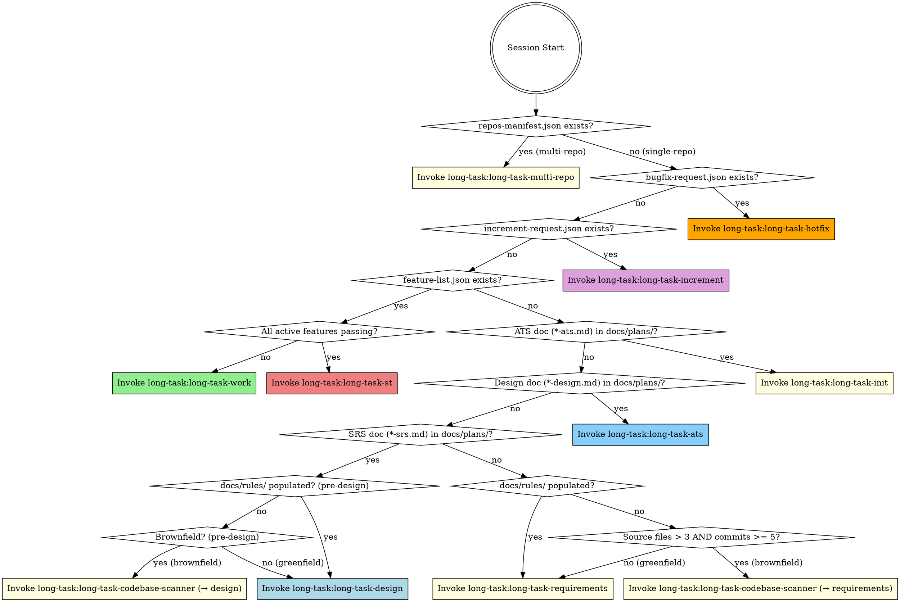

<EXTREMELY-IMPORTANT>
You are in a long-task multi-session project. You MUST invoke the correct phase skill BEFORE any response or action — including clarifying questions.

IF A PHASE SKILL APPLIES, YOU DO NOT HAVE A CHOICE. YOU MUST USE IT.

This is not negotiable. This is not optional. You cannot rationalize your way out of this.

**LANGUAGE RULE**: You MUST respond to the user in Chinese (Simplified). All generated documents, reports, and user-facing output must be written in Chinese. Skill names, code identifiers, and JSON field names remain in English.
</EXTREMELY-IMPORTANT>

## How to Access Skills

Use the `Skill` tool to invoke skills by name (e.g., `long-task:long-task-work`). When invoked, the skill content is loaded and presented to you — follow it directly. Never use the Read tool on skill files.

## Phase Detection

Check project state and invoke the corresponding skill:

**Step 0: Multi-Repo Detection** (before all other checks)

Check if `repos-manifest.json` exists in project root (generated by session-start hook when project root is NOT a git repo but has sub-directory git repos).

If `repos-manifest.json` exists → invoke `long-task:long-task-multi-repo`
(Multi-repo skill handles everything independently: exploration, global SRS, split, dependency distribution, handoff)

If `repos-manifest.json` does NOT exist → **single-repo project** → proceed to detection rules below.

---

**Detection rules** (single-repo):
0. Check `bugfix-request.json` in project root → if exists → `long-task-hotfix` **(HIGHEST priority)**
   Note: If both `bugfix-request.json` AND `increment-request.json` exist, hotfix runs first; `increment-request.json` is preserved and processed next session.
1. Check `increment-request.json` in project root → if exists → `long-task-increment`
2. Check `feature-list.json` in project root → if exists:
   - Run `python scripts/check_st_readiness.py feature-list.json` — if exit 0 (all active features passing, excludes deprecated) → `long-task-st`
   - Otherwise (some active features failing) → `long-task-work`
3. Check `docs/plans/*-ats.md` → if any match → `long-task-init` (ATS done, proceed to init)
4. Check `docs/plans/*-design.md` → if any match → `long-task-ats` (Design done, proceed to ATS)
5. Check `docs/plans/*-srs.md` → if any match:
   a. Check `docs/rules/` — if exists AND contains ≥1 `.md` file (beyond a greenfield stub) → `long-task-design` (rules present, proceed to design)
   b. Check for existing source files (brownfield heuristic — same logic as rule 7b): count source files excluding `.git/`, `node_modules/`, `venv/`, `dist/`, `build/`; and check `git rev-list --count HEAD 2>/dev/null || echo 0`
      - If source files > 3 AND git commits ≥ 5 → **invoke `long-task:long-task-codebase-scanner`** (see Phase 0-pre below) with `--next-skill long-task-design`
      - If source files > 3 AND git unavailable (no `.git` in cwd) → still treat as brownfield → **invoke `long-task:long-task-codebase-scanner`** with `--next-skill long-task-design`
   c. Else (greenfield or no source files) → create `docs/rules/README.md` stub ("Greenfield — no conventions to extract") if missing → `long-task-design`
7. Otherwise → check codebase conventions:
   a. Check `docs/rules/` — if exists AND contains ≥1 `.md` file (beyond a greenfield stub) → `long-task-requirements` (rules already scanned)
   b. Check for existing source files (brownfield heuristic): count source files (`*.py`, `*.js`, `*.ts`, `*.java`, `*.c`, `*.cpp`, `*.go`, `*.rs`, etc.) excluding `.git/`, `node_modules/`, `venv/`, `dist/`, `build/`; and check `git rev-list --count HEAD 2>/dev/null || echo 0`
      - If source files > 3 AND git commits ≥ 5 → **invoke `long-task:long-task-codebase-scanner`** (see Phase 0-pre below) with `--next-skill long-task-requirements`
      - If source files > 3 AND git unavailable (no `.git` in cwd) → still treat as brownfield → **invoke `long-task:long-task-codebase-scanner`** with `--next-skill long-task-requirements`
      - Else (greenfield) → create `docs/rules/README.md` stub ("Greenfield — no conventions to extract") → `long-task-requirements`

## Skill Catalog

### Phase Skills (invoke ONE based on detection above)
| Skill | Phase | When |
|-------|-------|------|
| `long-task:long-task-multi-repo` | Multi-repo | repos-manifest.json exists — handles exploration, global SRS, split, dependency distribution |
| `long-task:long-task-hotfix` | Hotfix | bugfix-request.json exists (HIGHEST priority) |
| `long-task:long-task-increment` | Phase 1.5 | increment-request.json exists |
| `long-task:long-task-codebase-scanner` | Phase 0-pre | No rules docs AND existing source files > 3 — scan codebase before requirements (rule 7b) or before design (rule 5b) |
| `long-task:long-task-requirements` | Phase 0a | No SRS, no design doc, no feature-list.json |
| `long-task:long-task-design` | Phase 0b | SRS exists, no design doc, no feature-list.json |
| `long-task:long-task-ats` | Phase 0d | Design doc exists, no ATS doc, no feature-list.json |
| `long-task:long-task-init` | Phase 1 | ATS doc exists (or auto-skipped for tiny projects), no feature-list.json |
| `long-task:long-task-work` | Phase 2 | feature-list.json exists, some active features failing |
| `long-task:long-task-st` | Phase 3 | feature-list.json exists, ALL active features passing |

### Standalone Skills (invoke independently — no pipeline dependency)
| Skill | Purpose | Trigger |
|-------|---------|---------|
| `long-task:long-task-explore` | Deep codebase exploration — architecture, data flow, domain model, API surface, dependencies, code health | On-demand via `/deep-explore [quick\|standard\|deep] [--focus area] [--path dir]` |

### Discipline Skills (invoked by long-task-work as sub-skills — do NOT invoke directly)
| Skill | Purpose |
|-------|---------|
| `long-task:long-task-feature-design` | Feature Detailed Design — interface contracts, algorithm pseudocode, state diagrams, boundary matrices, test inventory (bridges system design → TDD) |
| `long-task:long-task-feature-st` | Black-Box Feature Acceptance Testing — self-managed start/cleanup lifecycle, ISO/IEC/IEEE 29119 test case documentation (per-feature, after Quality Gates) |
| `long-task:long-task-tdd` | TDD Red-Green-Refactor | |

## Key Files (shared contract)

| File | Role |
|------|------|
| `docs/plans/*-srs.md` | Approved SRS — the WHAT |
| `docs/plans/*-deferred.md` | Deferred requirements backlog — next-round pickup via increment |
| `docs/plans/*-design.md` | Approved design — the HOW |
| `docs/plans/*-ats.md` | Approved ATS — the TEST STRATEGY (requirement→scenario mapping) |
| `feature-list.json` | Task inventory — the central shared state |
| `task-progress.md` | `## Current State` header (progress) + session-by-session log |
| `long-task-guide.md` | Project-specific Worker guide |
| `RELEASE_NOTES.md` | Living changelog |
| `docs/test-cases/feature-*.md` | Per-feature ST test case documents (ISO/IEC/IEEE 29119) |
| `docs/plans/*-st-report.md` | System testing report — Go/No-Go verdict |
| `bugfix-request.json` | Signal file — triggers hotfix session (deleted after processing) |
| `increment-request.json` | Signal file — triggers incremental requirements (deleted after processing) |
| `docs/rules/*.md` | Codebase conventions — coding style, 2/3方件 constraints, build patterns (brownfield only) |
| `repos-manifest.json` | Multi-repo topology — generated by hook, used by `long-task-multi-repo` skill (absent in single-repo projects) |

## Red Flags

These thoughts mean STOP — you're rationalizing:

| Thought | Reality |
|---------|---------|
| "Let me just look at the code first" | Invoke phase skill first. It tells you HOW to orient. |
| "I know which feature to work on" | Worker skill has Orient step. Follow it. |
| "This feature is simple, skip TDD" | long-task-tdd is non-negotiable. |
| "Tests pass, I can mark it done" | Quality gates (Worker Step 8) MUST pass first. |
| "I remember the workflow" | Skills evolve. Load current version via Skill tool. |
| "I need more context first" | Skill check comes BEFORE exploration. |
| "I'll just do this one thing first" | Check BEFORE doing anything. |
| "Requirements are obvious, skip to design" | long-task-requirements captures what you'd miss. |
| "Test categories can be decided during feature-st" | Ad-hoc assignment leads to SEC/PERF gaps. Run ATS first. |
| "ATS is overkill for this project" | Check Scaling Guide — tiny projects auto-skip ATS. |
| "The SRS already implies the design" | SRS = WHAT, design = HOW. Both are needed. |
| "All features pass, we can ship" | Feature tests ≠ system tests. Run ST phase first. |
| "System testing is overkill" | Integration bugs, NFR failures, and workflow gaps hide until ST. |
| "I'll just add features to the JSON directly" | Invoke the `long-task-increment` skill for tracked, audited changes. |
| "The requirement change is small, no need for impact analysis" | Increment skill catches hidden dependencies. |
| "I'll just fix this quick bug directly" | Invoke `long-task-hotfix` — bug gets tracked in feature-list.json as category=bugfix and fixed via the full Worker pipeline. |
| "I'll generate examples during Worker" | Examples are post-ST (ST Step 13). |
| "I already know the project's conventions" | Invoke `long-task-codebase-scanner`. Implicit knowledge doesn't persist across sessions. 2/3方件 constraints are easy to miss. |
| "This brownfield project is small, no need to scan" | Auto-skip handles greenfield (≤3 files). Let the codebase-scanner skill decide. |

## Skill Priority

1. **Phase skill first** — determines the entire session workflow
2. **Discipline skills second** — invoked by Worker in strict order (tdd → quality → st-case → review)
3. **On error** — follow systematic-debugging approach in `skills/long-task-work/references/systematic-debugging.md` before any fix

## Phase 0-pre: Codebase Convention Scan (Brownfield Only)

When detection rule 5b or 7b triggers (brownfield project, no existing `docs/rules/`):

- Rule 7b (no SRS): `Skill(skill="long-task:long-task-codebase-scanner", args="--next-skill long-task-requirements")`
- Rule 5b (SRS exists, no design): `Skill(skill="long-task:long-task-codebase-scanner", args="--next-skill long-task-design")`

The codebase-scanner skill handles all orchestration (directory creation, language detection, convention scanning, validation, user review) and chains to the next skill.
