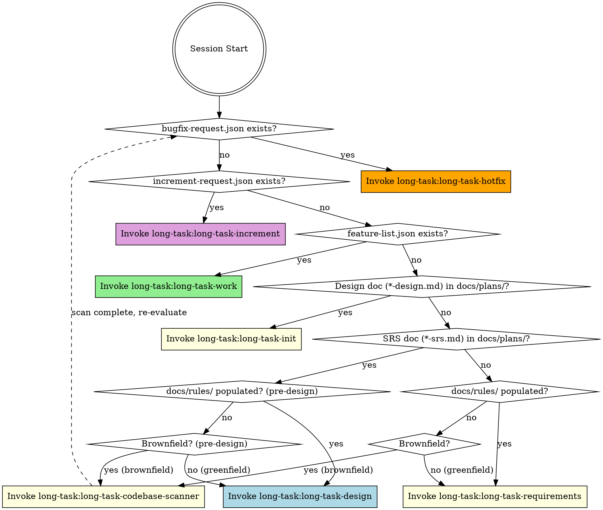

<EXTREMELY-IMPORTANT>
你正处于 long-task 多会话项目中。你必须在任何响应或操作之前（包括澄清问题）调用正确的阶段 skill。

如果某个阶段 skill 适用，你没有选择。你必须使用它。

这不可协商。不是可选的。你无法通过合理化来绕过它。
</EXTREMELY-IMPORTANT>

## 如何访问 Skill

使用 `Skill` 工具按名称调用 skill（如 `long-task:long-task-work`）。调用后 skill 内容会加载并呈现给你 — 直接遵循即可。永远不要用 Read 工具读取 skill 文件。

## 阶段检测

检查项目状态并调用对应的 skill：

**前置条件**：若项目根目录存在 `repos-manifest.json`（由 session-start hook 生成），此路由器不适用 — 直接调用 `long-task:long-task-multi-repo`。以下规则仅适用于单仓库项目。

---

**检测规则**：
0. 检查项目根目录 `bugfix-request.json` → 若存在 → `long-task-hotfix` **（最高优先级）**
   注意：若 `bugfix-request.json` 和 `increment-request.json` 同时存在，热修复先运行；`increment-request.json` 保留待下一会话处理。
1. 检查项目根目录 `increment-request.json` → 若存在 → `long-task-increment`
2. 检查项目根目录 `feature-list.json` → 若存在 → `long-task-work`
3. 检查 `docs/plans/*-design.md` → 若匹配 → `long-task-init`（设计完成，进入初始化）
4. 检查 `docs/plans/*-srs.md` → 若匹配：
   a. 检查 `docs/rules/` — 若存在且包含 ≥1 个 `.md` 文件（非新建项目桩） → `long-task-design`（规则已就绪，进入设计）
   b. 存量项目启发式：统计排除 `.git/`、`node_modules/`、`venv/`、`dist/`、`build/` 的源文件数；检查 `git rev-list --count HEAD 2>/dev/null || echo 0`
      - 若源文件 > 3 且（git 提交数 ≥ 5 或 cwd 中无 `.git`） → **分派独立 SubAgent（使用 General 或 Agent） 执行 `long-task:long-task-codebase-scanner`**。解析返回：Verdict DONE → 从头重新执行检测规则；Verdict FAIL → 上报用户。
   c. 否则（新建项目或无源文件） → 若缺失则创建 `docs/rules/README.md` 桩（"Greenfield — no conventions to extract"） → `long-task-design`
5. 否则 → 检查代码库约定：
   a. 检查 `docs/rules/` — 若存在且包含 ≥1 个 `.md` 文件（非新建项目桩） → `long-task-requirements`（规则已扫描）
   b. 存量项目启发式：统计源文件（`*.py`、`*.js`、`*.ts`、`*.java`、`*.c`、`*.cpp`、`*.go`、`*.rs` 等）排除 `.git/`、`node_modules/`、`venv/`、`dist/`、`build/`；检查 `git rev-list --count HEAD 2>/dev/null || echo 0`
      - 若源文件 > 3 且（git 提交数 ≥ 5 或 cwd 中无 `.git`） → **分派独立 SubAgent（使用 General 或 Agent） 执行 `long-task:long-task-codebase-scanner`**。解析返回：Verdict DONE → 从头重新执行检测规则；Verdict FAIL → 上报用户。
      - 否则（新建项目） → 创建 `docs/rules/README.md` 桩（"Greenfield — no conventions to extract"） → `long-task-requirements`

## Skill 目录

### 阶段 Skill（根据上方检测结果调用其一）
| Skill | 阶段 | 触发条件 |
|-------|------|---------|
| `long-task:long-task-hotfix` | 热修复 | bugfix-request.json 存在（最高优先级） |
| `long-task:long-task-increment` | Phase 1.5 | increment-request.json 存在 |
| `long-task:long-task-codebase-scanner` | Phase 0-pre | 无规则文档且存量项目 — 扫描代码库约定后重新检测路由 |
| `long-task:long-task-requirements` | Phase 0a | 无 SRS、无设计文档、无 feature-list.json |
| `long-task:long-task-design` | Phase 0b | SRS 存在、无设计文档、无 feature-list.json |
| `long-task:long-task-init` | Phase 1 | 设计文档存在、无 feature-list.json |
| `long-task:long-task-work` | Phase 2 | feature-list.json 存在 |

### 独立 Skill（独立调用 — 无流水线依赖）
| Skill | 用途 | 触发方式 |
|-------|------|---------|
| `long-task:long-task-explore` | 深度代码库探索 — 架构、数据流、领域模型、API 表面、依赖、代码健康度 | 按需 `/deep-explore [quick\|standard\|deep] [--focus area] [--path dir]` |
| `long-task:long-task-coverage-retrofit` | 为现有/遗留代码库补充 UT 覆盖率直至行+分支阈值达标 | 按需 `/coverage-retrofit [--path dir] [--files list] [--branch <branch>] [--max-iterations N] [--line-cov N] [--branch-cov N] [--dry-run]` |
| `long-task:long-task-mutation-retrofit` | 为现有/遗留代码库补充变异测试直至变异分数阈值达标 | 按需 `/mutation-retrofit [--path dir] [--files list] [--branch <branch>] [--max-iterations N] [--mutation N] [--skip-coverage-check] [--dry-run]` |

### 学科 Skill（由 long-task-work 作为子 skill 调用 — 不可直接调用）
| Skill | 用途 |
|-------|------|
| `long-task:long-task-feature-design` | 功能详细设计 — 接口契约、实现摘要、测试清单 |
| `long-task:long-task-tdd-red` | TDD Red — 为 Test Inventory 编写失败测试 |
| `long-task:long-task-tdd-green` | TDD Green — 最小实现使所有测试通过 |
| `long-task:long-task-tdd-refactor` | TDD Refactor — 清理 + 静态分析 + §11 合规 |

## 关键文件（共享契约）

| 文件 | 角色 |
|------|------|
| `docs/plans/*-srs.md` | 已批准的 SRS — WHAT |
| `docs/plans/*-deferred.md` | 延迟需求积压 — 下轮通过 increment 拾取 |
| `docs/plans/*-design.md` | 已批准的设计 — HOW |
| `feature-list.json` | 任务清单 — 核心共享状态 |
| `task-progress.md` | `## Current State` 标题（进度）+ 逐会话日志 |
| `long-task-guide.md` | 项目专属 Worker 指南 |
| `RELEASE_NOTES.md` | 持续更新的变更日志 |
| `bugfix-request.json` | 信号文件 — 触发热修复会话（处理后删除） |
| `increment-request.json` | 信号文件 — 触发增量需求（处理后删除） |
| `docs/rules/*.md` | 代码库约定 — 编码风格、二方件约束、构建模式（仅存量项目） |

## 危险信号

这些想法意味着停下 — 你在合理化：

| 想法 | 现实 |
|------|------|
| "让我先看看代码" | 先调用阶段 skill。它告诉你如何定向。 |
| "我知道该做哪个功能" | Worker skill 有 Orient 步骤。遵循它。 |
| "这个功能很简单，跳过 TDD" | long-task-tdd 不可协商。 |
| "测试通过了，可以标记完成" | TDD Refactor（Worker Step 5）必须先通过。 |
| "我记得工作流" | Skill 会演进。通过 Skill 工具加载当前版本。 |
| "我需要先了解更多上下文" | Skill 检查在探索之前。 |
| "让我先做这一件事" | 做任何事之前先检查。 |
| "需求很明显，跳到设计" | long-task-requirements 能捕获你遗漏的内容。 |
| "SRS 已经暗示了设计" | SRS = WHAT，设计 = HOW。两者都需要。 |
| "我直接在 JSON 里加功能就行" | 调用 `long-task-increment` skill 进行有跟踪、可审计的变更。 |
| "需求变更很小，不需要影响分析" | Increment skill 能捕获隐藏的依赖。 |
| "我直接快速修这个 bug" | 调用 `long-task-hotfix` — bug 在 feature-list.json 中被记录为 category=bugfix 并通过完整 Worker 流水线修复。 |
| "我已经了解项目的约定" | 调用 `long-task-codebase-scanner`。隐式知识不会跨会话持久化。二方件约束容易遗漏。 |
| "这个存量项目很小，不需要扫描" | 自动跳过机制处理新建项目（≤3 文件）。让 codebase-scanner skill 决定。 |

## Skill 优先级

1. **阶段 skill 优先** — 决定整个会话工作流
2. **学科 skill 次之** — 由 Worker 按严格顺序调用（feature-design → tdd → persist）
3. **遇到错误时** — 在任何修复前遵循 `skills/long-task-work/references/systematic-debugging.md` 中的系统化调试方法

## Phase 0-pre：代码库约定扫描（仅存量项目）

当检测规则 4b 或 5b 触发时（存量项目，无现有 `docs/rules/`）：

> **DISPATCH** 创建独立 SubAgent（使用 General 或 Agent）— 在 subagent 中加载并执行 skill `long-task:long-task-codebase-scanner`

**解析：** 解析 SubAgent 返回文本（结构化返回契约）。
- Verdict DONE → `docs/rules/` 已填充，从头重新执行检测规则 — 规则 4a 或 5a 将自然匹配并路由到正确的下一个 skill。
- Verdict FAIL → 上报用户。
